# Zal System Requirements Document (SRD)

Status: living document, verified against the code on 15 Nov 2026. Product intent (users, stories, journeys, scope) is in the [PRD](../product/prd.md). This document covers the system: components, interfaces, state, data, deployment and verification. Where this file and the code disagree, the code wins and the gap goes to [§14](#14-open-items).

Sources of truth, in order: code, [contracts.md](contracts.md), [requirements.md](requirements.md), [runbooks](../runbooks/).

## Contents
1. [Scope and context](#1-scope-and-context)
2. [Architecture](#2-architecture)
3. [Components](#3-components)
4. [Contract interfaces](#4-contract-interfaces)
5. [State machines](#5-state-machines)
6. [Sequences](#6-sequences)
7. [Data](#7-data)
8. [API](#8-api)
9. [Requirements](#9-requirements)
10. [Security model](#10-security-model)
11. [Deployment](#11-deployment)
12. [Testing and verification](#12-testing-and-verification)
13. [Traceability](#13-traceability)
14. [Open items](#14-open-items)

---

## 1. Scope and context

Zal is an on-chain payment canvas on an Avalanche L1 (Zalax L1, chain id 102026, gas token ZAX). Every canvas is the same `CanvasAccount` contract. Two accounts form a buyer and seller relationship. The seller issues Invoice NFTs, and the buyer approves, escrows and pays them in one transaction that runs through the seller's Split. A funding pool advances money against approved invoices (reverse factoring). Money is testnet zUSDC. The off-chain services (indexer and API, keeper, web) hold no authority over funds; they read, present and trigger.

In scope: 7 contracts in [`packages/contracts`](../../packages/contracts), the indexer and `/v1` API, the schedule keeper, the web app with its in-browser sandbox, the local and L1 docker stacks. Out of scope: bridging, Stream payments, disputes, overdue handling, credit scoring, upgradeability ([contracts.md](contracts.md#out-of-scope-for-v1-contracts)).

### System context

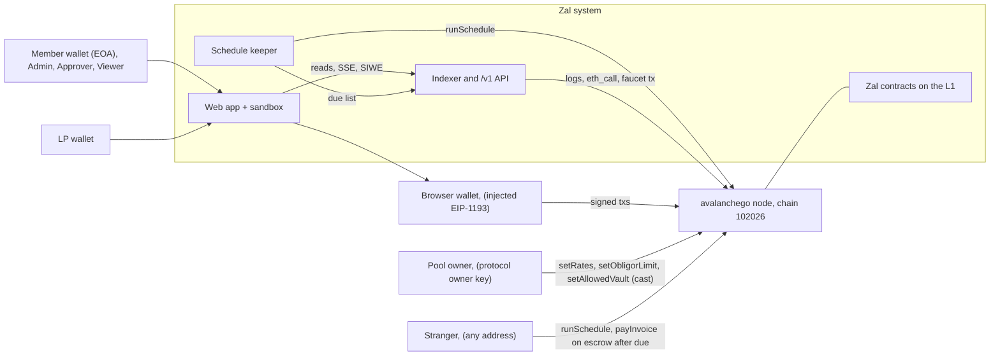
```mermaid
flowchart LR
    M["Member wallet (EOA), Admin, Approver, Viewer"]
    LP["LP wallet"]
    PO["Pool owner, (protocol owner key)"]
    ST["Stranger, (any address)"]
    subgraph Zal["Zal system"]
        WEB["Web app + sandbox"]
        API["Indexer and /v1 API"]
        KEEP["Schedule keeper"]
        L1["Zal contracts on the L1"]
    end
    WAL["Browser wallet, (injected EIP-1193)"]
    NODE["avalanchego node, chain 102026"]

    M --> WEB
    LP --> WEB
    WEB --> WAL
    WAL -- "signed txs" --> NODE
    WEB -- "reads, SSE, SIWE" --> API
    PO -- "setRates, setObligorLimit, setAllowedVault (cast)" --> NODE
    ST -- "runSchedule, payInvoice on escrow after due" --> NODE
    KEEP -- "runSchedule" --> NODE
    KEEP -- "due list" --> API
    API -- "logs, eth_call, faucet tx" --> NODE
    NODE --- L1
```

| Actor | Identity | Can do | Cannot do |
|---|---|---|---|
| Member wallet | EOA holding a `MemberRole` on one or more accounts | Admin: every direct action and gated op. Approver: submit, confirm, revoke, cancel schedules. Viewer: read | Act on an account where `roleOf` is None |
| LP | Any wallet | `deposit`, `withdraw`, `redeem` on `ZalFundingPool` | Withdraw more than idle cash (ZR-FND-05) |
| Pool owner | `Ownable` owner of pool, factory, vault | `setRates`, `setObligorLimit`, `wire` (once), `setAllowedVault`, `simulateYield` | Move account or escrow funds |
| Keeper | Gas-only wallet ([packages/keeper](../../packages/keeper)) | `runSchedule` on due schedules | Choose amount or recipient (ZR-SCH-05) |
| Stranger | Any address | `runSchedule`; `payInvoice` on an escrowed invoice once `now >= dueDate` (ZR-PAY-03); `createAccount`; `ZUSDC.mint` | Call `receivePayment` (AT-16), any account action |

---

## 2. Architecture

### Containers

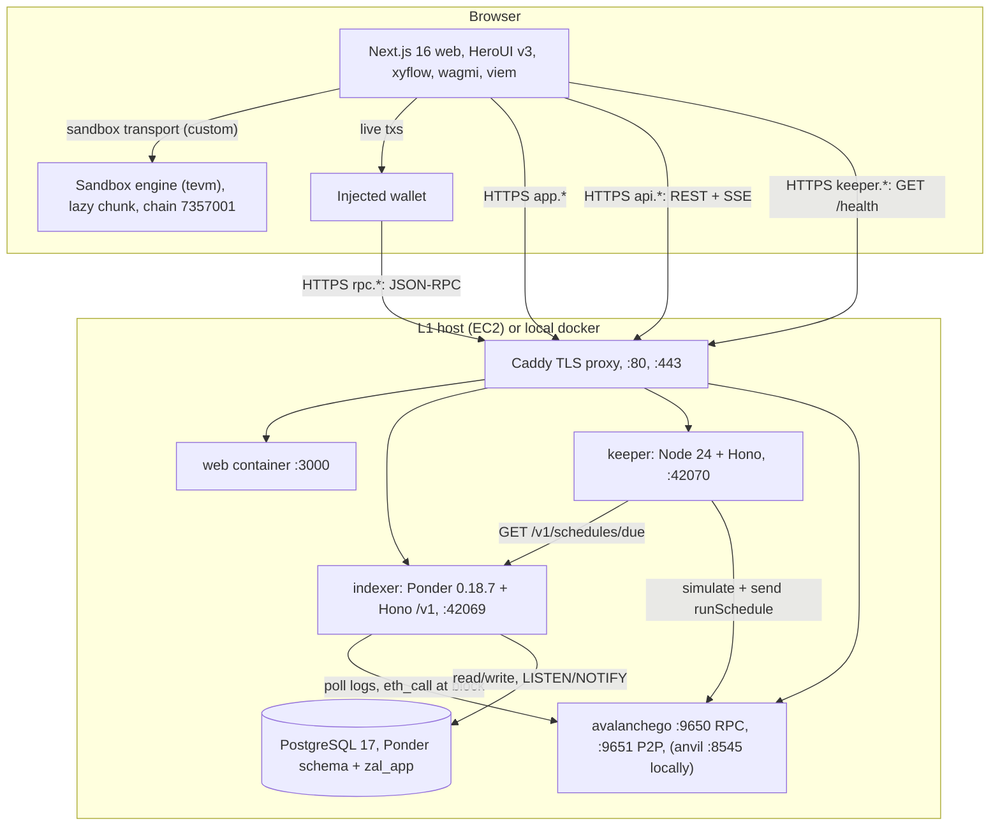
```mermaid
flowchart TB
    subgraph Browser
        UI["Next.js 16 web, HeroUI v3, xyflow, wagmi, viem"]
        SB["Sandbox engine (tevm), lazy chunk, chain 7357001"]
        W["Injected wallet"]
        UI -- "sandbox transport (custom)" --> SB
        UI -- "live txs" --> W
    end
    subgraph Host["L1 host (EC2) or local docker"]
        CADDY["Caddy TLS proxy, :80, :443"]
        WEBC["web container :3000"]
        IDX["indexer: Ponder 0.18.7 + Hono /v1, :42069"]
        PG[("PostgreSQL 17, Ponder schema + zal_app")]
        KP["keeper: Node 24 + Hono, :42070"]
        NODE["avalanchego :9650 RPC, :9651 P2P, (anvil :8545 locally)"]
    end
    UI -- "HTTPS app.*" --> CADDY
    UI -- "HTTPS api.*: REST + SSE" --> CADDY
    UI -- "HTTPS keeper.*: GET /health" --> CADDY
    W -- "HTTPS rpc.*: JSON-RPC" --> CADDY
    CADDY --> WEBC
    CADDY --> IDX
    CADDY --> KP
    CADDY --> NODE
    IDX -- "poll logs, eth_call at block" --> NODE
    IDX -- "read/write, LISTEN/NOTIFY" --> PG
    KP -- "GET /v1/schedules/due" --> IDX
    KP -- "simulate + send runSchedule" --> NODE
```

### Contract dependencies and trust

Solid arrows are calls. Only `ZalInvoice` and `ZalFundingPool` may call `CanvasAccount.receivePayment` (rule 6, ZR-ACC-08), because it trusts that the transfer already happened.

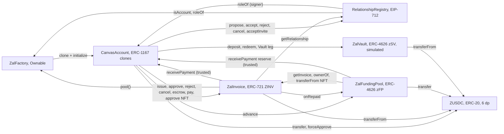
```mermaid
flowchart LR
    F["ZalFactory, Ownable"]
    A["CanvasAccount, ERC-1167 clones"]
    R["RelationshipRegistry, EIP-712"]
    I["ZalInvoice, ERC-721 ZINV"]
    P["ZalFundingPool, ERC-4626 zFP"]
    V["ZalVault, ERC-4626 zSV, simulated"]
    U["ZUSDC, ERC-20, 6 dp"]

    F -- "clone + initialize" --> A
    A -- "propose, accept, reject, cancel, acceptInvite" --> R
    A -- "issue, approve, reject, cancel, escrow, pay, approve NFT" --> I
    A -- "advance" --> P
    A -- "deposit, redeem, Vault leg" --> V
    A -- "transfer, forceApprove" --> U
    R -- "isAccount, roleOf" --> F
    R -- "roleOf (signer)" --> A
    I -- "getRelationship" --> R
    I -- "pool()" --> F
    I -- "receivePayment (trusted)" --> A
    I -- "onRepaid" --> P
    I -- "transferFrom" --> U
    P -- "getInvoice, ownerOf, transferFrom NFT" --> I
    P -- "receivePayment reserve (trusted)" --> A
    P -- "transfer" --> U
    V -- "transferFrom" --> U
```

Wiring ([contracts.md](contracts.md#implementation-decisions-14-nov-2026)): the factory deploys the `CanvasAccount` implementation in its constructor; registry and invoices take the factory; the pool takes invoices; `wire(usdc, registry, invoices, pool)` closes the cycle once and checks each address (`WiringMismatch`). Accounts copy the wiring at `initialize`.

---

## 3. Components

### `packages/contracts` (Foundry, Solidity 0.8.25, cancun, OpenZeppelin 5)

| Module | Responsibility | Key files |
|---|---|---|
| Types | Enums and structs shared by all contracts | [src/lib/ZalTypes.sol](../../packages/contracts/src/lib/ZalTypes.sol) |
| Account | Members, policy, gated ops, spend window, budgets, Split, schedules, direct actions | [src/CanvasAccount.sol](../../packages/contracts/src/CanvasAccount.sol) |
| Factory | Clones, `isAccount`, wiring, vault allow-list | [src/ZalFactory.sol](../../packages/contracts/src/ZalFactory.sol) |
| Relationships | Propose, accept, reject, cancel, EIP-712 invites | [src/RelationshipRegistry.sol](../../packages/contracts/src/RelationshipRegistry.sol) |
| Invoices | NFT, state machine, escrow, settlement, transfer restriction | [src/ZalInvoice.sol](../../packages/contracts/src/ZalInvoice.sol) |
| Pool | LP shares, advances, repayment split, obligor limits | [src/ZalFundingPool.sol](../../packages/contracts/src/ZalFundingPool.sol) |
| Vault | Simulated yield | [src/ZalVault.sol](../../packages/contracts/src/ZalVault.sol) |
| Token | Testnet dollars, open mint | [src/ZUSDC.sol](../../packages/contracts/src/ZUSDC.sol) |
| Deploy | Deploy and wire, write `deployments/<net>.json` | [script/Deploy.s.sol](../../packages/contracts/script/Deploy.s.sol), [script/config/](../../packages/contracts/script/config), [deployments/](../../packages/contracts/deployments), [docker-deploy.sh](../../packages/contracts/docker-deploy.sh) |
| Tests | Unit, AT-*, invariants INV-*, mutation | [test/](../../packages/contracts/test), [tools/mutate.py](../../packages/contracts/tools/mutate.py) |

### `packages/indexer` (Ponder 0.18.7, Hono 4.13.18, viem 2.57.16, drizzle-orm 0.41.0, Node 24)

| Module | Responsibility | Key files |
|---|---|---|
| Config | Chain, RPC, addresses from env or deployment file; all 7 contracts, accounts discovered via `AccountCreated` | [ponder.config.ts](../../packages/indexer/ponder.config.ts), [lib/deployment.ts](../../packages/indexer/lib/deployment.ts) |
| On-chain schema | Read model rebuilt from events | [ponder.schema.ts](../../packages/indexer/ponder.schema.ts) |
| Handlers | One file per contract area; each event writes rows and `feed`, then `pg_notify` | [src/account.ts](../../packages/indexer/src/account.ts), [src/relationships.ts](../../packages/indexer/src/relationships.ts), [src/invoices.ts](../../packages/indexer/src/invoices.ts), [src/pool.ts](../../packages/indexer/src/pool.ts), [src/tokens.ts](../../packages/indexer/src/tokens.ts), [src/feed.ts](../../packages/indexer/src/feed.ts) |
| API wiring | Composition root on Ponder's Hono server | [src/api/index.ts](../../packages/indexer/src/api/index.ts), [src/api/config.ts](../../packages/indexer/src/api/config.ts), [src/api/read.ts](../../packages/indexer/src/api/read.ts) |
| Routes | `/v1` REST, auth, writes, rate limits, errors | [lib/app.ts](../../packages/indexer/lib/app.ts), [lib/errors.ts](../../packages/indexer/lib/errors.ts), [lib/rate-limit.ts](../../packages/indexer/lib/rate-limit.ts) |
| SSE | Shared LISTEN client, per-stream cursor, caps | [src/api/stream.ts](../../packages/indexer/src/api/stream.ts), [lib/feed-channel.ts](../../packages/indexer/lib/feed-channel.ts) |
| Auth | SIWE checks, bearer tokens | [lib/siwe.ts](../../packages/indexer/lib/siwe.ts) |
| Canvas | Rows to web `CanvasState`, activity, notifications | [lib/canvas.ts](../../packages/indexer/lib/canvas.ts), [lib/notifications.ts](../../packages/indexer/lib/notifications.ts), [lib/web-mirror/](../../packages/indexer/lib/web-mirror) |
| Off-chain store | `zal_app` schema and migrations | [lib/app-db/schema.ts](../../packages/indexer/lib/app-db/schema.ts), [drizzle/](../../packages/indexer/drizzle) |
| Invites, layout, faucet | Input schemas and routes | [lib/invite.ts](../../packages/indexer/lib/invite.ts), [lib/layout.ts](../../packages/indexer/lib/layout.ts), [lib/faucet.ts](../../packages/indexer/lib/faucet.ts) |

### `packages/keeper` (Node 24, Hono 4.13.18, viem 2.57.16)

| Module | Responsibility | Key files |
|---|---|---|
| Config | Env parse; key held only by the signer | [lib/config.ts](../../packages/keeper/lib/config.ts) |
| Loop | Tick, per-schedule backoff, run history | [lib/keeper.ts](../../packages/keeper/lib/keeper.ts) |
| Chain | Next-block time, simulate at that time, send with fixed gas | [lib/chain.ts](../../packages/keeper/lib/chain.ts) |
| Indexer client | `GET /v1/schedules/due` | [lib/indexer.ts](../../packages/keeper/lib/indexer.ts) |
| HTTP | `GET /health`, `GET /status`, CORS to web origins | [lib/http.ts](../../packages/keeper/lib/http.ts) |
| Entry | Composition root, SIGTERM | [src/main.ts](../../packages/keeper/src/main.ts) |

### `packages/web` (Next.js 16.3.6, HeroUI 3.2.7, xyflow 12.12.1, wagmi 3.7.11, viem 2.57.16, tevm 1.0.0-rc.151)

| Module | Responsibility | Key files |
|---|---|---|
| Network config | Live chain from build env, sandbox chain, wagmi transports | [config/chains.ts](../../packages/web/config/chains.ts), [config/env.ts](../../packages/web/config/env.ts), [config/wagmi.ts](../../packages/web/config/wagmi.ts) |
| Generated contracts | ABIs, bytecode, deployments from `packages/contracts` | [contracts/](../../packages/web/contracts), [scripts/gen-contracts.ts](../../packages/web/scripts/gen-contracts.ts) |
| Identity | `TrustedIdentity`, `VerifiedCanvas` from wallet and chain | [lib/contracts/identity.ts](../../packages/web/lib/contracts/identity.ts) |
| Chain reads | Direct reads, `ChainVerified<T>` for signing controls | [lib/contracts/canvas-reads.ts](../../packages/web/lib/contracts/canvas-reads.ts), [lib/contracts/chain-verified.ts](../../packages/web/lib/contracts/chain-verified.ts) |
| Writes | Simulate, send, wait for receipt, wait for indexer | [lib/contracts/write.ts](../../packages/web/lib/contracts/write.ts), [hooks/contracts/](../../packages/web/hooks/contracts) |
| API client | zod-parsed `/v1` client, session store, stream mapping, layout sync | [lib/api/](../../packages/web/lib/api) |
| Live updates | SSE with chain-polling fallback | [hooks/use-live-updates.ts](../../packages/web/hooks/use-live-updates.ts), [hooks/contracts/events.ts](../../packages/web/hooks/contracts/events.ts) |
| Canvas model | Graph from state, ghost/solid, layout, child canvases, drafts, palette, notifications, schedules, spend window | [lib/canvas/](../../packages/web/lib/canvas) |
| Sandbox | Mode store, transport, connector, tevm engine, bots, journal | [lib/sandbox/](../../packages/web/lib/sandbox) |
| UI | Canvas, inspector, palette, inbox, timeline, guided demo, overview, landing | [components/](../../packages/web/components), [app/](../../packages/web/app) |
| E2E drivers | Headless browser runs, sandbox and live | [e2e/](../../packages/web/e2e) |

---

## 4. Contract interfaces

Legend: **Gated** = reachable only through `submit`/`confirm` (`onlySelf`). **NR** = `nonReentrant` (transient storage). Errors are custom errors from source; inner-call errors propagate. Views are listed after each table.

### CanvasAccount ([source](../../packages/contracts/src/CanvasAccount.sol))

| Function | Caller | Gated | Events | Errors |
|---|---|---|---|---|
| `initialize(admin)` | factory, once | no | `MemberSet`, `PolicySet` | `NotFactory`, `AlreadyInitialized`, `ZeroAddress` |
| `setMember(member, role)` | Admin | no | `MemberSet(member, role, policyNonce)` | `NotAdmin`, `ZeroAddress`, `LastAdmin`, `InvalidThreshold` |
| `setPolicy(threshold, approvalLimit)` | Admin | no | `PolicySet(threshold, limit, policyNonce)` | `NotAdmin`, `InvalidThreshold` |
| `setEndpointPublic(bool)` | Admin | no | `EndpointVisibilitySet` | `NotAdmin` |
| `submit(bytes data)` NR | Approver, Admin | entry | `OpSubmitted`, `OpConfirmed`; on execute `SpendWindowCharged` (below threshold or threshold 1), `OpExecuted` | `NotApprover`, `OpNotAllowed`, inner errors |
| `confirm(opId)` NR | Approver, Admin | entry | `OpConfirmed`; on execute as above | `NotApprover`, `OpNotFound`, `OpAlreadyExecuted`, `OpStale`, `AlreadyConfirmed` |
| `revoke(opId)` NR | a wallet that confirmed | entry | `OpRevoked` | `OpNotFound`, `OpAlreadyExecuted`, `OpStale`, `NotConfirmed` |
| `approveInvoice(invoiceId, budgetId)` | self | yes, amount = face | `BudgetCharged` (if budgeted), `InvoiceApproved` | `NotSelf`, `BudgetNotFound`, `BudgetExceeded` |
| `escrowInvoice(invoiceId)` | self | yes, amount = face | `InvoiceEscrowed` | `NotSelf` |
| `payInvoice(invoiceId)` | self | yes, amount = face | settlement events (§6.6) | `NotSelf` |
| `withdraw(to, amount)` | self | yes, amount | `Withdrawn` | `NotSelf`, `ZeroAddress` |
| `createSchedule(kind, recipient, invoiceId, amount, start, interval, runs)` | self | yes, Transfer `amount × runs`, PayInvoice face | `ScheduleCreated` | `NotSelf`, `ScheduleStartTooSoon`, `InvalidScheduleTiming`, `InvalidScheduleRecipient`, `InvoiceNotSchedulable` |
| `cancelSchedule(id)` | Approver, Admin | no | `ScheduleCancelled` | `NotApprover`, `ScheduleNotActive` |
| `runSchedule(id)` NR | anyone | no | `ScheduleRan`, plus `Transfer` or settlement events | `ScheduleNotActive`, `ScheduleNotDue`, token or invoice errors |
| `proposeRelationship(counterparty, myRole, expiresAt)` | Admin | no | `RelationshipProposed` | `NotAdmin`, registry errors |
| `acceptRelationship` / `rejectRelationship` / `cancelRelationship(id)` | Admin | no | registry events | `NotAdmin`, registry errors |
| `acceptInvite(invite, sig)` | Admin | no | `RelationshipProposed`, `RelationshipAccepted` | `NotAdmin`, registry errors |
| `issueInvoice(relId, face, due, docHash)` | Admin | no | `Transfer` (mint), `InvoiceIssued` | `NotAdmin`, invoice errors |
| `cancelInvoice(id)` / `rejectInvoice(id)` | Admin | no | invoice events | `NotAdmin`, invoice errors |
| `requestAdvance(invoiceId)` NR | Admin | no | `Approval` (NFT), `Transfer`, `Advanced` | `NotAdmin`, pool errors |
| `setBudget(budgetId, limit, periodLength)` | Admin | no | `BudgetSet` | `NotAdmin`, `InvalidBudget` |
| `setRoute(Leg[])` | Admin | no | `RouteSet` | `NotAdmin`, `InvalidRoute`, `VaultNotAllowed` |
| `vaultDeposit(vault, amount)` NR | Admin | no | `VaultDeposited` | `NotAdmin`, `VaultNotAllowed` |
| `vaultRedeem(vault, shares)` NR | Admin | no | `VaultRedeemed` | `NotAdmin` |
| `receivePayment(invoiceId, amount)` | `ZalInvoice` or `ZalFundingPool` only, not NR (ZR-ACC-10) | no | `LegFailed` (per failed leg), `PaymentRouted` | `NotSettlement` |

Views: `roleOf`, `adminCount`, `approverCount`, `threshold`, `approvalLimit`, `policyNonce`, `endpointPublic`, `requiredConfirmations(amount)`, `spendWindow()`, `getOp`, `opCount`, `hasConfirmed`, `budgets`, `getRoute`, `getSchedule`, `scheduleCount`. Constants: `BPS = 10_000`, `MAX_LEGS = 8`, `DEFAULT_BUDGET_PERIOD = 30 days`, `MIN_SCHEDULE_DELAY = 60`, `MIN_SCHEDULE_INTERVAL = 60`, `MAX_SCHEDULE_RUNS = 1000`, `SPEND_WINDOW = 1 days`.

Gated selectors (`_gatedAmount`, exact calldata lengths): `withdraw` (64 B args), `approveInvoice` (64), `escrowInvoice` (32), `payInvoice` (32), `createSchedule` (224). Any other selector or length reverts `OpNotAllowed` (ZR-ACC-03).

### RelationshipRegistry ([source](../../packages/contracts/src/RelationshipRegistry.sol))

`msg.sender` is always the acting account. EIP-712 domain `("Zal RelationshipRegistry", "1")`, typehash `Invite(address proposer,uint8 proposerRole,bytes32 inviteeEmailHash,uint256 nonce,uint64 deadline)`.

| Function | Caller | Events | Errors |
|---|---|---|---|
| `propose(counterparty, proposerRole, expiresAt)` | an account | `RelationshipCancelled` (replaced expired), `RelationshipProposed` | `ExpiryInPast`, `SelfRelationship`, `NotAccount`, `RelationshipExists` |
| `accept(id)` | non-proposer party, `Proposed`, not expired | `RelationshipAccepted` | `NotProposed`, `ProposalExpired`, `NotCounterparty` |
| `reject(id)` | non-proposer party, `Proposed`, not expired | `RelationshipRejected` | same as `accept` |
| `cancel(id)` | proposer, `Proposed` (also after expiry) | `RelationshipCancelled` | `NotProposed`, `NotProposer` |
| `acceptInvite(invite, sig)` | any account (becomes counterparty) | `RelationshipProposed`, `RelationshipAccepted` | `InviteExpired`, `InviteNonceUsed`, `NotAccount`, `InviteSignerNotAdmin`, `RelationshipExists`, ECDSA errors |

Views: `getRelationship`, `relationshipCount`, `liveRelationship(buyer, seller)`, `inviteNonceUsed(proposer, nonce)`, `hashInvite`, `domainSeparator`, `INVITE_TYPEHASH`.

### ZalInvoice ([source](../../packages/contracts/src/ZalInvoice.sol), ERC-721 "Zal Invoice" / ZINV)

| Function | Caller | Events | Errors |
|---|---|---|---|
| `issueInvoice(relId, face, due, docHash)` | seller of an `Active` relationship | `Transfer` (mint), `InvoiceIssued` | `RelationshipNotActive`, `NotSeller`, `ZeroFaceValue`, `DueDateNotInFuture` |
| `approveInvoice(id)` | buyer, `Issued` | `InvoiceApproved` | `WrongStatus`, `NotBuyer` |
| `rejectInvoice(id)` | buyer, `Issued` | `InvoiceRejected` | `WrongStatus`, `NotBuyer` |
| `cancelInvoice(id)` | seller, `Issued` | `Transfer` (burn), `InvoiceCancelled` | `WrongStatus`, `NotSeller` |
| `escrowInvoice(id)` NR | buyer, `Approved`, once | `InvoiceEscrowed` | `WrongStatus`, `NotBuyer`, `AlreadyEscrowed` |
| `payInvoice(id)` NR | buyer; or anyone if escrowed and `now >= dueDate` | `PaymentRouted`/`Repaid` (callee), `InvoicePaid` | `WrongStatus`, `NotPayable` |
| ERC-721 `transferFrom` / `safeTransferFrom` | only the pool pulling seller → pool while `Approved` | `Transfer` | `TransferRestricted` |

Views: `getInvoice`, `invoiceCount`, `totalEscrowed`, ERC-721 views.

### ZalFundingPool ([source](../../packages/contracts/src/ZalFundingPool.sol), ERC-4626 "Zal Funding Pool LP" / zFP)

| Function | Caller | Events | Errors |
|---|---|---|---|
| `setRates(advanceRateBps, annualFeeBps)` | owner | `RatesSet` | `InvalidAdvanceRate` (rate outside 1..10,000) |
| `setObligorLimit(buyer, limit)` | owner | `ObligorLimitSet` | Ownable |
| `advance(invoiceId)` NR | invoice seller account, still owner | `Transfer` (NFT), `Transfer` (USDC), `Advanced(id, seller, principal, fee, onCredit)` | `NotSeller`, `NotApproved`, `AlreadyFunded`, `PastDue`, `ZeroPrincipal`, `FeeExceedsReserve`, `ObligorLimitExceeded`, `InsufficientIdleCash` |
| `onRepaid(invoiceId, amount)` NR | `ZalInvoice` only | `Transfer` (reserve), `PaymentRouted` (seller), `Repaid` | `NotInvoiceContract`, `NoAdvance`, `WrongRepayment` |
| `deposit`, `mint` NR | anyone | ERC-4626 `Deposit` | ERC-4626 |
| `withdraw`, `redeem` NR | share owner or allowed | ERC-4626 `Withdraw` | `ERC4626ExceededMaxWithdraw` / `ERC4626ExceededMaxRedeem` (cap = idle cash) |

Views: `quote(face, due)`, `idleCash`, `advanceOf`, `outstanding`, `obligorLimit`, `obligorOutstanding`, `advanceRateBps`, `annualFeeBps`, `totalAssets = idleCash + outstanding`, `maxWithdraw`, `maxRedeem`. `_decimalsOffset = 6`.

### ZalVault ([source](../../packages/contracts/src/ZalVault.sol), ERC-4626 "Zal Simulated Vault" / zSV)

| Function | Caller | Events | Errors |
|---|---|---|---|
| `setKeeper(keeper)` | owner | `KeeperSet` | Ownable |
| `simulateYield(amount)` NR | owner or keeper | `YieldSimulated` | `NotOwnerOrKeeper`, `ZeroAmount` |
| ERC-4626 entry points NR | anyone | `Deposit`, `Withdraw` | ERC-4626 |

### ZalFactory ([source](../../packages/contracts/src/ZalFactory.sol))

| Function | Caller | Events | Errors |
|---|---|---|---|
| `wire(usdc, registry, invoices, pool)` | owner, once | `Wired` | `AlreadyWired`, `ZeroAddress`, `WiringMismatch` |
| `createAccount(admin, salt)` | anyone, after wiring | `MemberSet`, `PolicySet`, `AccountCreated` | `NotWired`, `ZeroAddress` |
| `setAllowedVault(vault, allowed)` | owner | `AllowedVaultSet` | `VaultAssetMismatch` |

Views: `predictAccount(admin, salt)` (salt = `keccak256(abi.encode(admin, salt))`), `isAccount`, `allowedVault`, `accountImplementation`, `usdc`, `registry`, `invoices`, `pool`.

### ZUSDC ([source](../../packages/contracts/src/ZUSDC.sol))
ERC-20 "Zal USD Coin (testnet)" / zUSDC, 6 decimals, `mint(to, amount)` open to anyone.

---

## 5. State machines

### 5.1 Relationship (ZR-REL-01..03)

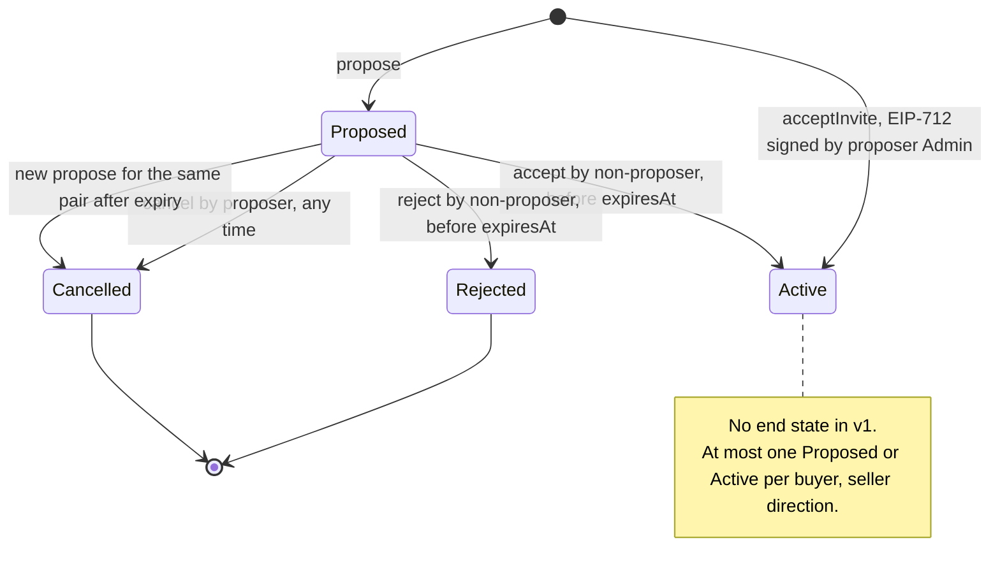
```mermaid
stateDiagram-v2
    [*] --> Proposed : propose
    [*] --> Active : acceptInvite, EIP-712 signed by proposer Admin
    Proposed --> Active : accept by non-proposer, before expiresAt
    Proposed --> Rejected : reject by non-proposer, before expiresAt
    Proposed --> Cancelled : cancel by proposer, any time
    Proposed --> Cancelled : new propose for the same pair after expiry
    Rejected --> [*]
    Cancelled --> [*]
    note right of Active
        No end state in v1.
        At most one Proposed or Active per buyer, seller direction.
    end note
```

### 5.2 Invoice (ZR-INV-*, ZR-PAY-*, INV-04, INV-09)

Escrow and funding are two independent flags inside `Approved`. Funded is derived: `ownerOf(id) == pool`.

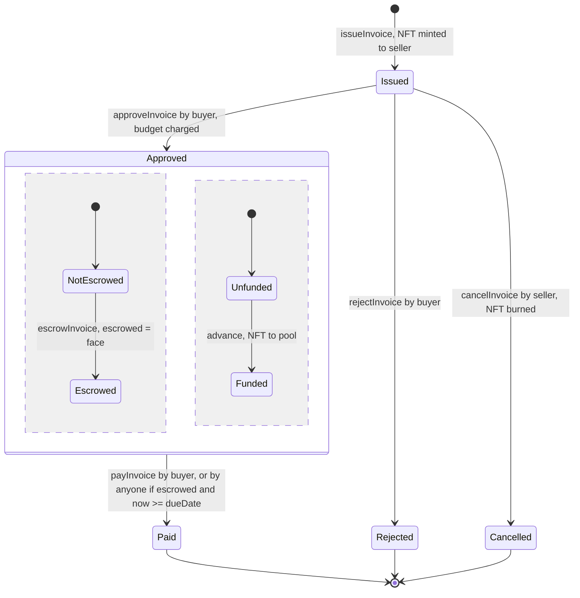
```mermaid
stateDiagram-v2
    [*] --> Issued : issueInvoice, NFT minted to seller
    Issued --> Approved : approveInvoice by buyer, budget charged
    Issued --> Rejected : rejectInvoice by buyer
    Issued --> Cancelled : cancelInvoice by seller, NFT burned
    state Approved {
        [*] --> NotEscrowed
        NotEscrowed --> Escrowed : escrowInvoice, escrowed = face
        --
        [*] --> Unfunded
        Unfunded --> Funded : advance, NFT to pool
    }
    Approved --> Paid : payInvoice by buyer, or by anyone if escrowed and now >= dueDate
    Paid --> [*]
    Rejected --> [*]
    Cancelled --> [*]
```

Guards on `Unfunded → Funded`: `dueDate > now`, caller is seller and owner, and (escrowed, or buyer enrolled with `obligorOutstanding + principal <= obligorLimit`) (ZR-FND-07). On `Paid`, `escrowed` resets to 0; the NFT stays as the paid record.

### 5.3 Gated op (ZR-ACC-03..05, ZR-ACC-11, INV-08)

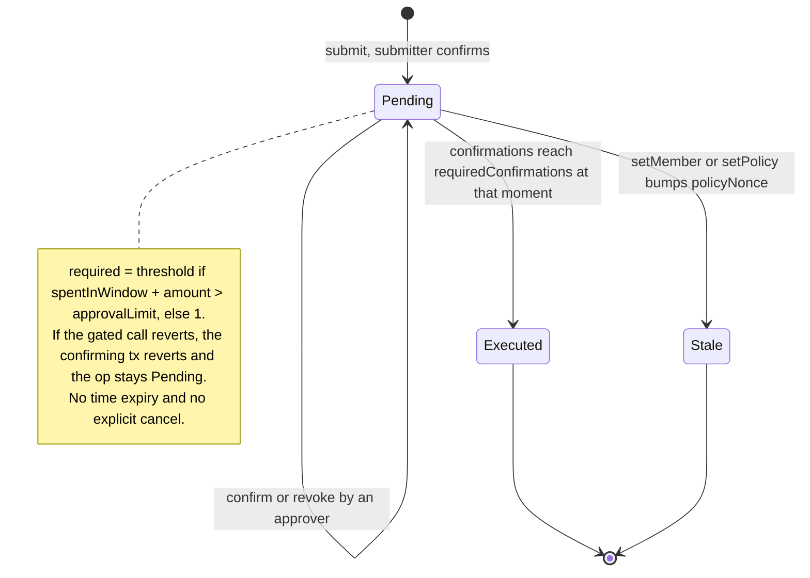
```mermaid
stateDiagram-v2
    [*] --> Pending : submit, submitter confirms
    Pending --> Pending : confirm or revoke by an approver
    Pending --> Executed : confirmations reach requiredConfirmations at that moment
    Pending --> Stale : setMember or setPolicy bumps policyNonce
    Executed --> [*]
    Stale --> [*]
    note right of Pending
        required = threshold if spentInWindow + amount > approvalLimit, else 1.
        If the gated call reverts, the confirming tx reverts and the op stays Pending.
        No time expiry and no explicit cancel.
    end note
```

`Stale` is derived (`op.policyNonce != policyNonce`), not stored.

### 5.4 Schedule (ZR-SCH-01..07, INV-11)

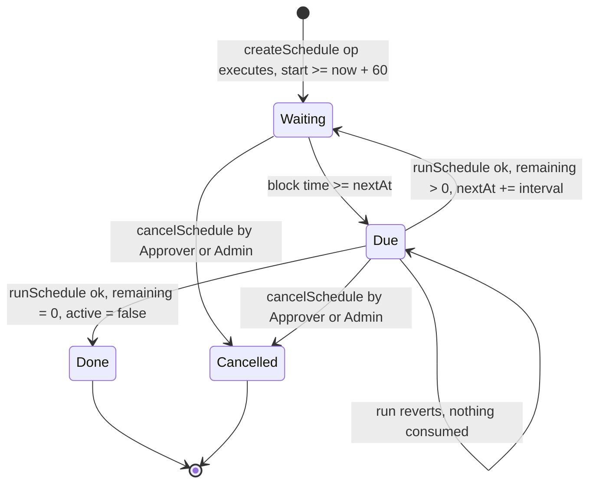
```mermaid
stateDiagram-v2
    [*] --> Waiting : createSchedule op executes, start >= now + 60
    Waiting --> Due : block time >= nextAt
    Due --> Waiting : runSchedule ok, remaining > 0, nextAt += interval
    Due --> Done : runSchedule ok, remaining = 0, active = false
    Due --> Due : run reverts, nothing consumed
    Waiting --> Cancelled : cancelSchedule by Approver or Admin
    Due --> Cancelled : cancelSchedule by Approver or Admin
    Done --> [*]
    Cancelled --> [*]
```

A schedule is not tied to `policyNonce`; it survives member and policy changes until cancelled. A PayInvoice run reverts forever if the invoice was paid another way, until cancelled.

### 5.5 Pool advance (ZR-FND-01..07, INV-01, INV-05, INV-10)

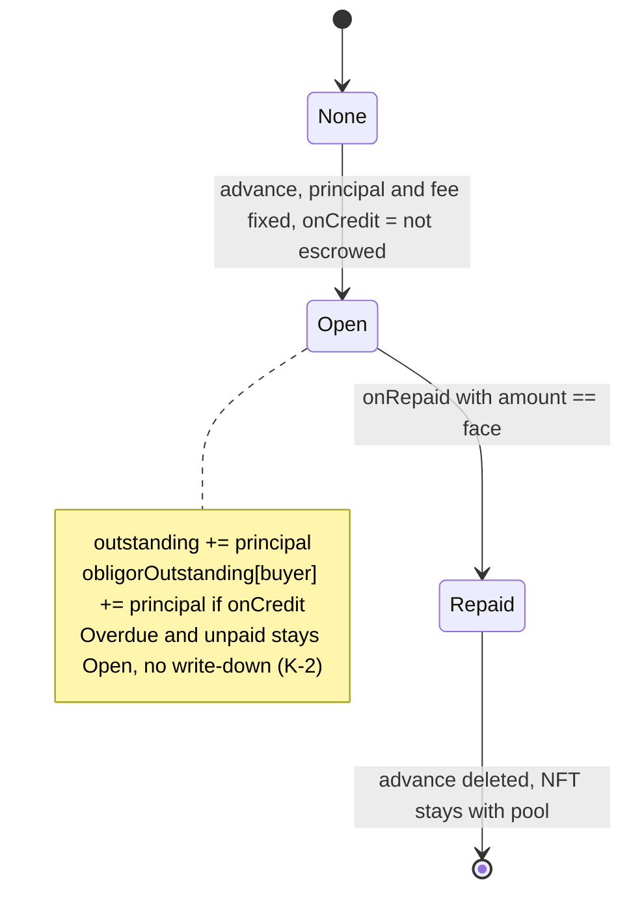
```mermaid
stateDiagram-v2
    [*] --> None
    None --> Open : advance, principal and fee fixed, onCredit = not escrowed
    Open --> Repaid : onRepaid with amount == face
    Repaid --> [*] : advance deleted, NFT stays with pool
    note right of Open
        outstanding += principal
        obligorOutstanding[buyer] += principal if onCredit
        Overdue and unpaid stays Open, no write-down (K-2)
    end note
```

### 5.6 Rolling 24 h spend window (ZR-ACC-11, INV-12)

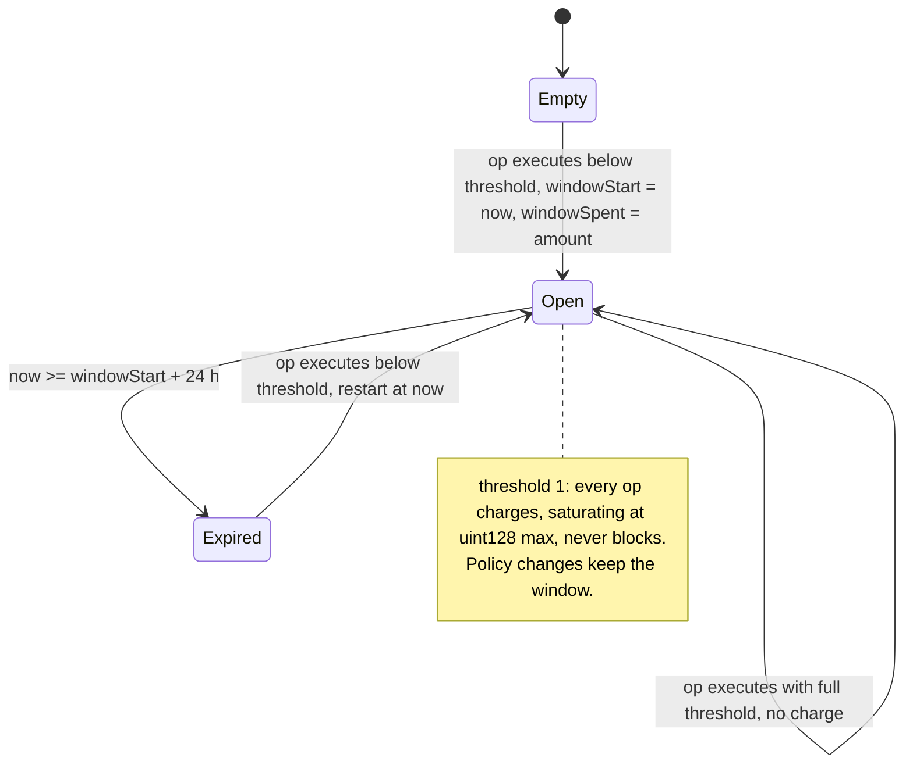
```mermaid
stateDiagram-v2
    [*] --> Empty
    Empty --> Open : op executes below threshold, windowStart = now, windowSpent = amount
    Open --> Open : op executes below threshold, windowSpent += amount
    Open --> Open : op executes with full threshold, no charge
    Open --> Expired : now >= windowStart + 24 h
    Expired --> Open : op executes below threshold, restart at now
    note right of Open
        threshold 1: every op charges, saturating at uint128 max, never blocks.
        Policy changes keep the window.
    end note
```

### 5.7 Canvas node commitment

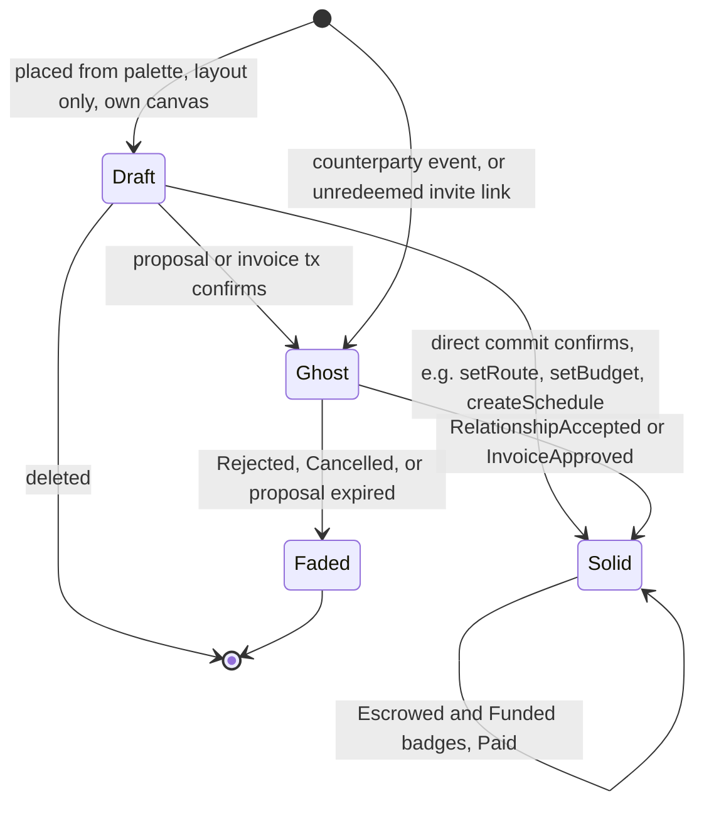
```mermaid
stateDiagram-v2
    [*] --> Draft : placed from palette, layout only, own canvas
    Draft --> [*] : deleted
    Draft --> Ghost : proposal or invoice tx confirms
    Draft --> Solid : direct commit confirms, e.g. setRoute, setBudget, createSchedule
    [*] --> Ghost : counterparty event, or unredeemed invite link
    Ghost --> Solid : RelationshipAccepted or InvoiceApproved
    Ghost --> Faded : Rejected, Cancelled, or proposal expired
    Solid --> Solid : Escrowed and Funded badges, Paid
    Faded --> [*]
```

| Canvas object | Ghost | Solid | Source |
|---|---|---|---|
| Counterparty | `Proposed`, or invite link (off-chain) | `Active` | registry events |
| Invoice | `Issued` | `Approved`, `Paid` | invoice events |
| Escrow badge | n/a | `escrowed == faceValue` | `InvoiceEscrowed` |
| Funded badge | n/a | `ownerOf == pool`, not `Paid` | ERC-721 `Transfer` |
| Draft node or link | n/a (dashed draft) | removed when the tx confirms | `zal_app.layouts` |

---

## 6. Sequences

### 6.1 Create a canvas

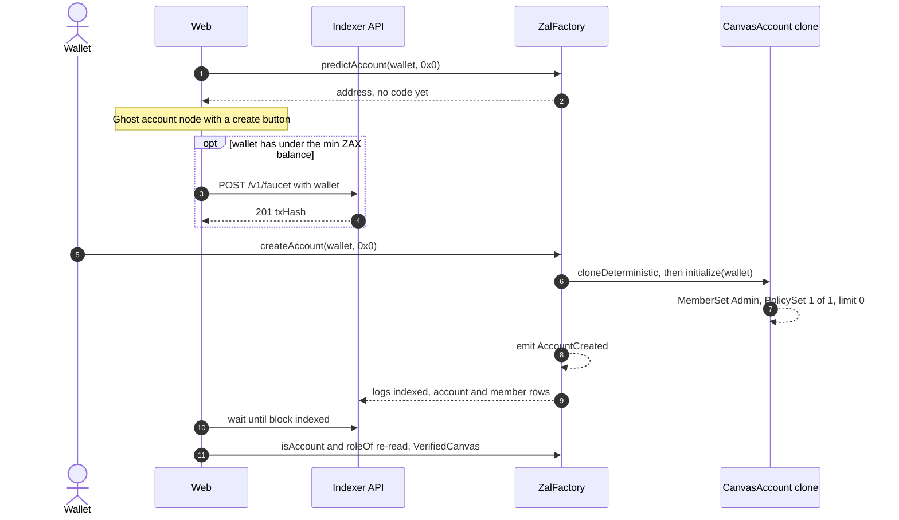
```mermaid
sequenceDiagram
    autonumber
    actor U as Wallet
    participant Web
    participant API as Indexer API
    participant F as ZalFactory
    participant A as CanvasAccount clone
    Web->>F: predictAccount(wallet, 0x0)
    F-->>Web: address, no code yet
    Note over Web: Ghost account node with a create button
    opt wallet has under the min ZAX balance
        Web->>API: POST /v1/faucet with wallet
        API-->>Web: 201 txHash
    end
    U->>F: createAccount(wallet, 0x0)
    F->>A: cloneDeterministic, then initialize(wallet)
    A-->>A: MemberSet Admin, PolicySet 1 of 1, limit 0
    F-->>F: emit AccountCreated
    F-->>API: logs indexed, account and member rows
    Web->>API: wait until block indexed
    Web->>F: isAccount and roleOf re-read, VerifiedCanvas
```

### 6.2 Propose and accept, or redeem an invite

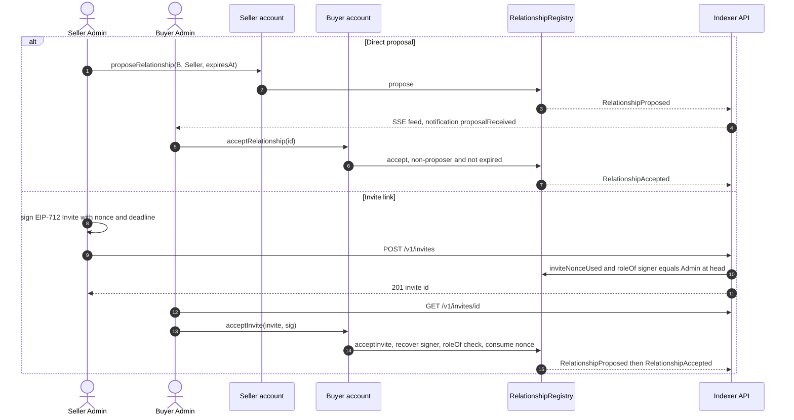
```mermaid
sequenceDiagram
    autonumber
    actor SA as Seller Admin
    actor BA as Buyer Admin
    participant S as Seller account
    participant B as Buyer account
    participant R as RelationshipRegistry
    participant API as Indexer API
    alt Direct proposal
        SA->>S: proposeRelationship(B, Seller, expiresAt)
        S->>R: propose
        R-->>API: RelationshipProposed
        API-->>BA: SSE feed, notification proposalReceived
        BA->>B: acceptRelationship(id)
        B->>R: accept, non-proposer and not expired
        R-->>API: RelationshipAccepted
    else Invite link
        SA->>SA: sign EIP-712 Invite with nonce and deadline
        SA->>API: POST /v1/invites
        API->>R: inviteNonceUsed and roleOf signer equals Admin at head
        API-->>SA: 201 invite id
        BA->>API: GET /v1/invites/id
        BA->>B: acceptInvite(invite, sig)
        B->>R: acceptInvite, recover signer, roleOf check, consume nonce
        R-->>API: RelationshipProposed then RelationshipAccepted
    end
```

### 6.3 Issue, approve against a budget, escrow

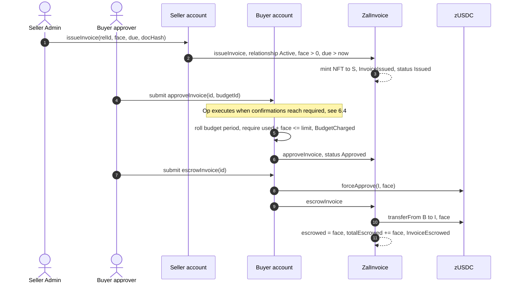
```mermaid
sequenceDiagram
    autonumber
    actor SA as Seller Admin
    actor c1 as Buyer approver
    participant S as Seller account
    participant B as Buyer account
    participant I as ZalInvoice
    participant U as zUSDC
    SA->>S: issueInvoice(relId, face, due, docHash)
    S->>I: issueInvoice, relationship Active, face > 0, due > now
    I-->>I: mint NFT to S, InvoiceIssued, status Issued
    c1->>B: submit approveInvoice(id, budgetId)
    Note over B: Op executes when confirmations reach required, see 6.4
    B->>B: roll budget period, require used + face <= limit, BudgetCharged
    B->>I: approveInvoice, status Approved
    c1->>B: submit escrowInvoice(id)
    B->>U: forceApprove(I, face)
    B->>I: escrowInvoice
    I->>U: transferFrom B to I, face
    I-->>I: escrowed = face, totalEscrowed += face, InvoiceEscrowed
```

### 6.4 Gated op, M of N, with the spend window

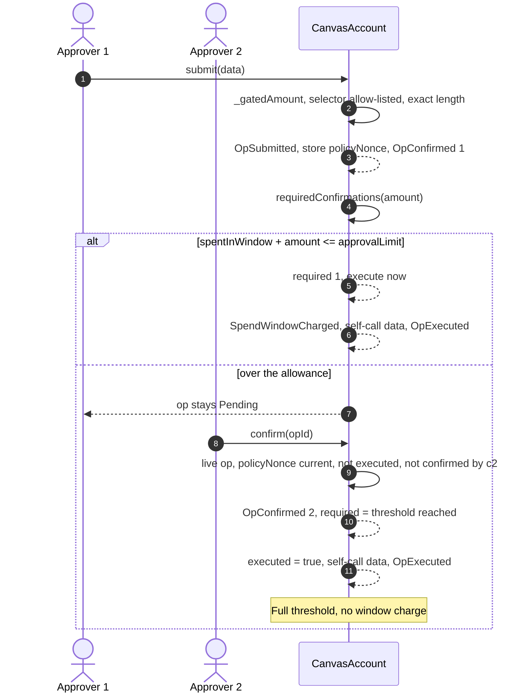
```mermaid
sequenceDiagram
    autonumber
    actor c1 as Approver 1
    actor c2 as Approver 2
    participant A as CanvasAccount
    c1->>A: submit(data)
    A->>A: _gatedAmount, selector allow-listed, exact length
    A-->>A: OpSubmitted, store policyNonce, OpConfirmed 1
    A->>A: requiredConfirmations(amount)
    alt spentInWindow + amount <= approvalLimit
        A-->>A: required 1, execute now
        A-->>A: SpendWindowCharged, self-call data, OpExecuted
    else over the allowance
        A-->>c1: op stays Pending
        c2->>A: confirm(opId)
        A->>A: live op, policyNonce current, not executed, not confirmed by c2
        A-->>A: OpConfirmed 2, required = threshold reached
        A-->>A: executed = true, self-call data, OpExecuted
        Note over A: Full threshold, no window charge
    end
```

### 6.5 Settlement, unfunded invoice

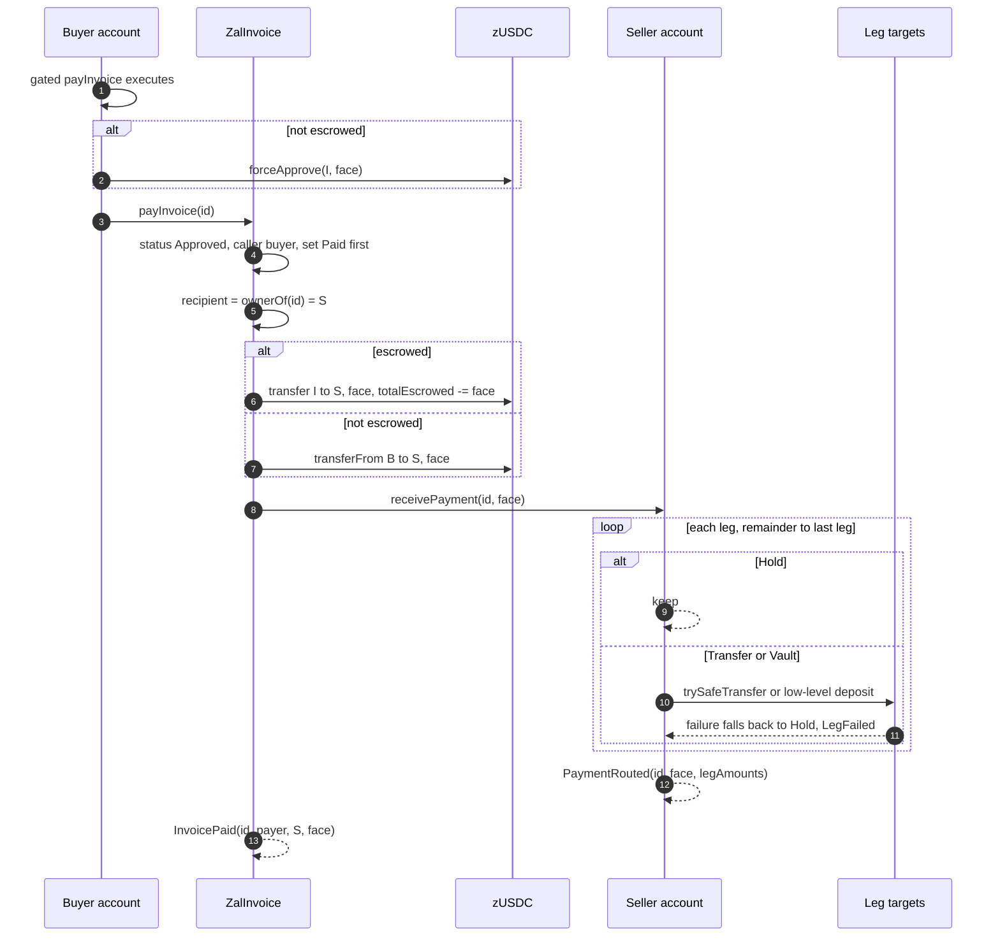
```mermaid
sequenceDiagram
    autonumber
    participant B as Buyer account
    participant I as ZalInvoice
    participant U as zUSDC
    participant S as Seller account
    participant T as Leg targets
    B->>B: gated payInvoice executes
    alt not escrowed
        B->>U: forceApprove(I, face)
    end
    B->>I: payInvoice(id)
    I->>I: status Approved, caller buyer, set Paid first
    I->>I: recipient = ownerOf(id) = S
    alt escrowed
        I->>U: transfer I to S, face, totalEscrowed -= face
    else not escrowed
        I->>U: transferFrom B to S, face
    end
    I->>S: receivePayment(id, face)
    loop each leg, remainder to last leg
        alt Hold
            S-->>S: keep
        else Transfer or Vault
            S->>T: trySafeTransfer or low-level deposit
            T-->>S: failure falls back to Hold, LegFailed
        end
    end
    S-->>S: PaymentRouted(id, face, legAmounts)
    I-->>I: InvoicePaid(id, payer, S, face)
```

### 6.6 Settlement, funded invoice (AT-09)

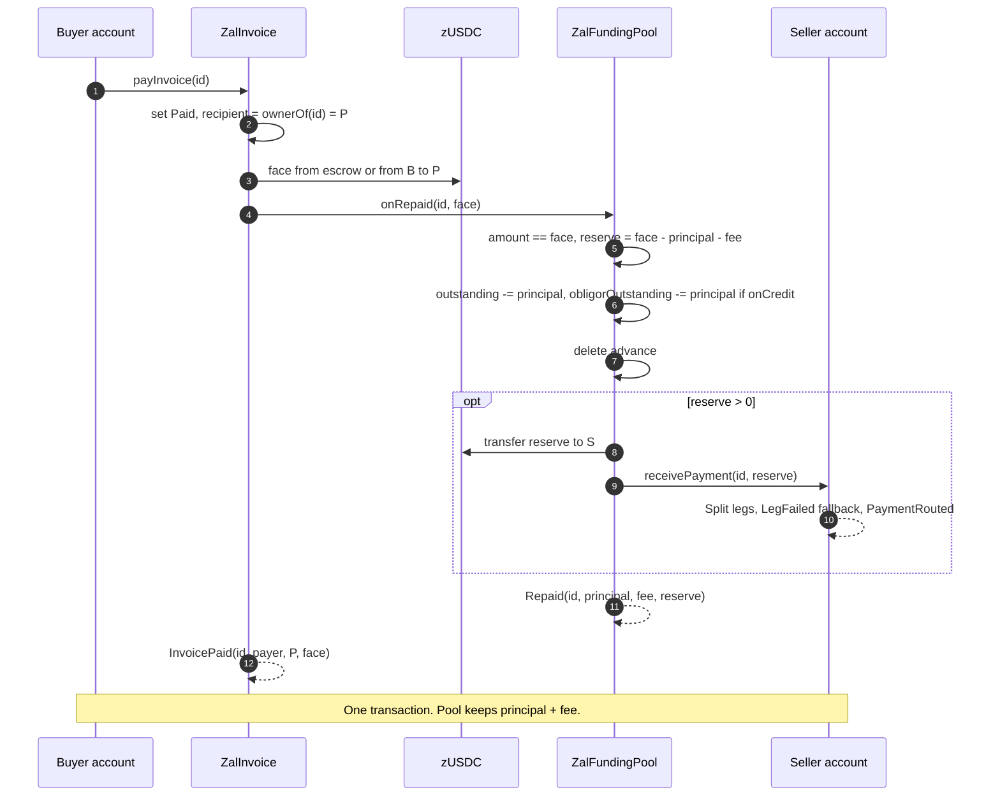
```mermaid
sequenceDiagram
    autonumber
    participant B as Buyer account
    participant I as ZalInvoice
    participant U as zUSDC
    participant P as ZalFundingPool
    participant S as Seller account
    B->>I: payInvoice(id)
    I->>I: set Paid, recipient = ownerOf(id) = P
    I->>U: face from escrow or from B to P
    I->>P: onRepaid(id, face)
    P->>P: amount == face, reserve = face - principal - fee
    P->>P: outstanding -= principal, obligorOutstanding -= principal if onCredit
    P->>P: delete advance
    opt reserve > 0
        P->>U: transfer reserve to S
        P->>S: receivePayment(id, reserve)
        S-->>S: Split legs, LegFailed fallback, PaymentRouted
    end
    P-->>P: Repaid(id, principal, fee, reserve)
    I-->>I: InvoicePaid(id, payer, P, face)
    Note over B,S: One transaction. Pool keeps principal + fee.
```

### 6.7 Advance request

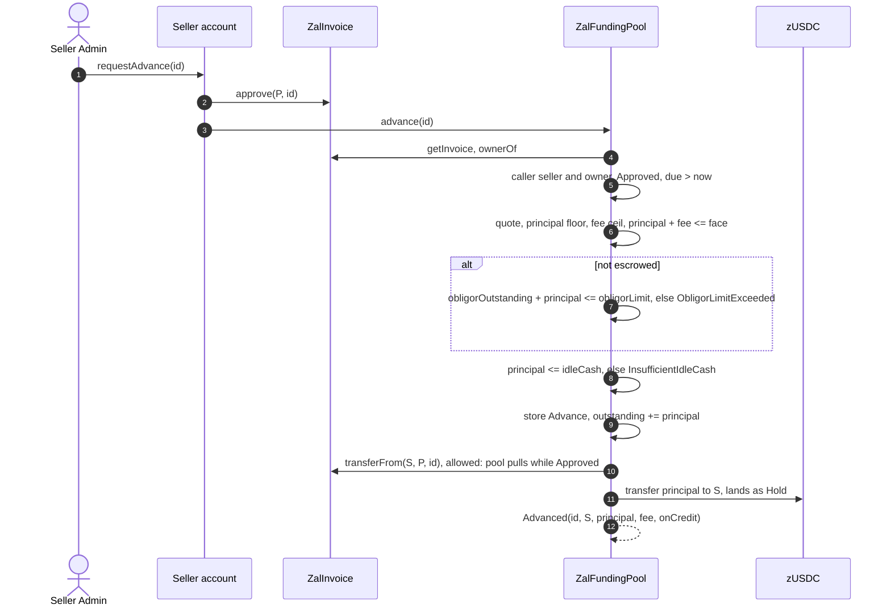
```mermaid
sequenceDiagram
    autonumber
    actor SA as Seller Admin
    participant S as Seller account
    participant I as ZalInvoice
    participant P as ZalFundingPool
    participant U as zUSDC
    SA->>S: requestAdvance(id)
    S->>I: approve(P, id)
    S->>P: advance(id)
    P->>I: getInvoice, ownerOf
    P->>P: caller seller and owner, Approved, due > now
    P->>P: quote, principal floor, fee ceil, principal + fee <= face
    alt not escrowed
        P->>P: obligorOutstanding + principal <= obligorLimit, else ObligorLimitExceeded
    end
    P->>P: principal <= idleCash, else InsufficientIdleCash
    P->>P: store Advance, outstanding += principal
    P->>I: transferFrom(S, P, id), allowed: pool pulls while Approved
    P->>U: transfer principal to S, lands as Hold
    P-->>P: Advanced(id, S, principal, fee, onCredit)
```

### 6.8 LP deposit and withdraw

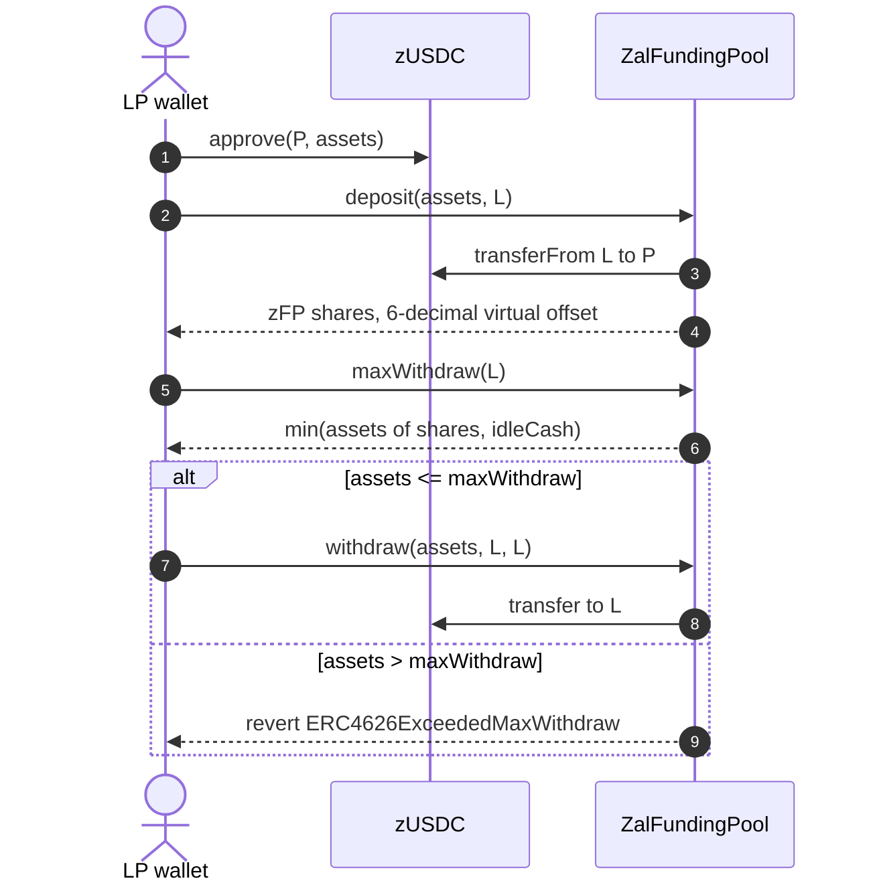
```mermaid
sequenceDiagram
    autonumber
    actor L as LP wallet
    participant U as zUSDC
    participant P as ZalFundingPool
    L->>U: approve(P, assets)
    L->>P: deposit(assets, L)
    P->>U: transferFrom L to P
    P-->>L: zFP shares, 6-decimal virtual offset
    L->>P: maxWithdraw(L)
    P-->>L: min(assets of shares, idleCash)
    alt assets <= maxWithdraw
        L->>P: withdraw(assets, L, L)
        P->>U: transfer to L
    else assets > maxWithdraw
        P-->>L: revert ERC4626ExceededMaxWithdraw
    end
```

### 6.9 Schedule: create, keeper tick, run

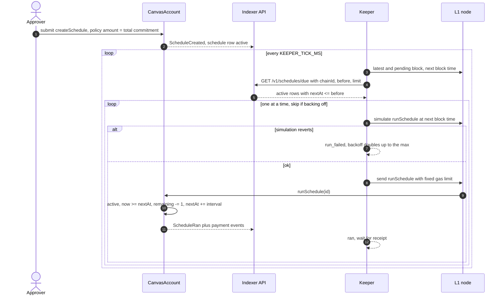
```mermaid
sequenceDiagram
    autonumber
    actor c1 as Approver
    participant A as CanvasAccount
    participant API as Indexer API
    participant K as Keeper
    participant N as L1 node
    c1->>A: submit createSchedule, policy amount = total commitment
    A-->>API: ScheduleCreated, schedule row active
    loop every KEEPER_TICK_MS
        K->>N: latest and pending block, next block time
        K->>API: GET /v1/schedules/due with chainId, before, limit
        API-->>K: active rows with nextAt <= before
        loop one at a time, skip if backing off
            K->>N: simulate runSchedule at next block time
            alt simulation reverts
                K-->>K: run_failed, backoff doubles up to the max
            else ok
                K->>N: send runSchedule with fixed gas limit
                N->>A: runSchedule(id)
                A->>A: active, now >= nextAt, remaining -= 1, nextAt += interval
                A-->>API: ScheduleRan plus payment events
                K-->>K: ran, wait for receipt
            end
        end
    end
```

### 6.10 Sign in (SIWE) to a bearer session

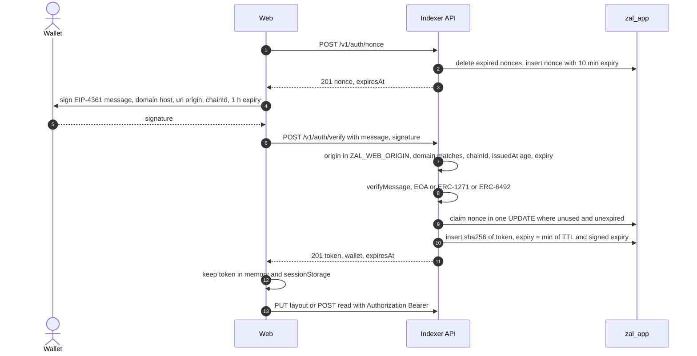
```mermaid
sequenceDiagram
    autonumber
    actor U as Wallet
    participant Web
    participant API as Indexer API
    participant DB as zal_app
    Web->>API: POST /v1/auth/nonce
    API->>DB: delete expired nonces, insert nonce with 10 min expiry
    API-->>Web: 201 nonce, expiresAt
    Web->>U: sign EIP-4361 message, domain host, uri origin, chainId, 1 h expiry
    U-->>Web: signature
    Web->>API: POST /v1/auth/verify with message, signature
    API->>API: origin in ZAL_WEB_ORIGIN, domain matches, chainId, issuedAt age, expiry
    API->>API: verifyMessage, EOA or ERC-1271 or ERC-6492
    API->>DB: claim nonce in one UPDATE where unused and unexpired
    API->>DB: insert sha256 of token, expiry = min of TTL and signed expiry
    API-->>Web: 201 token, wallet, expiresAt
    Web->>Web: keep token in memory and sessionStorage
    Web->>API: PUT layout or POST read with Authorization Bearer
```

### 6.11 Event to screen

```mermaid
sequenceDiagram
    autonumber
    participant N as L1 node
    participant IX as Ponder indexer
    participant PG as Postgres
    participant SSE as Stream handler
    participant Web
    IX->>N: poll logs
    IX->>PG: handler writes rows and feed row per subject
    IX->>PG: pg_notify zal_feed inside the indexing transaction
    PG-->>SSE: notification after commit
    SSE->>PG: read feed rows after this stream cursor
    SSE-->>Web: event feed, id block-logIndex
    Web->>Web: batch 150 ms, invalidate chain queries
    Web->>IX: refetch canvas, activity, notifications, pool
    Note over SSE,Web: Heartbeat 15 s re-reads. Last-Event-ID resumes. Over 2000 rows back sends reset.
    Note over Web,N: No stream for 4 s, then poll the chain and show Live updates paused
```

### 6.12 Gas faucet drip

```mermaid
sequenceDiagram
    autonumber
    participant Web
    participant API as Indexer API
    participant DB as zal_app
    participant N as L1 node
    Web->>API: POST /v1/faucet with wallet
    API->>API: IP rate limit, faucet configured, else 503
    API->>N: getBalance(wallet)
    alt balance >= min
        API-->>Web: 409 conflict
    else below min
        API->>DB: advisory lock, count drips per wallet and per IP in 24 h
        alt over a limit
            API-->>Web: 429 with Retry-After
        else allowed
            API->>DB: insert claim row
            API->>N: send native drip, serial queue, nonce manager
            alt send fails
                API->>DB: delete claim
                API-->>Web: 503
            else accepted
                API->>DB: set txHash
                API-->>Web: 201 txHash, amountWei
            end
        end
    end
```

### 6.13 Sandbox transport switch

```mermaid
sequenceDiagram
    autonumber
    actor U as Visitor
    participant Mode as Sandbox mode store
    participant Wagmi
    participant Conn as Sandbox connector
    participant RT as Sandbox runtime
    participant EVM as tevm in browser
    U->>Mode: turn Sandbox on
    Mode->>Mode: persist enabled and wallet address in localStorage
    Wagmi->>Conn: connect, reports the real wallet address
    Wagmi->>RT: first request on chain 7357001, dynamic import
    RT->>EVM: deploy bytecode, replay journal keyed by bytecode hash
    alt no journal
        RT->>EVM: seed account, club, print shop, co-signer, LP
    end
    U->>Wagmi: write
    Wagmi->>Conn: send without a signing prompt
    Conn->>RT: eth_sendTransaction as the wallet
    RT->>EVM: execute, append to journal
    RT->>RT: bots react after a delay, keeper runs due schedules
    U->>Mode: turn Sandbox off
    Note over Wagmi: Live chain uses http transport and the injected wallet again
```

---

## 7. Data

### 7.1 On-chain storage

Struct definitions: [ZalTypes.sol](../../packages/contracts/src/lib/ZalTypes.sol) (`Relationship`, `Invoice`, `Leg`, `Budget`, `Schedule`, `Advance`, `Invite`), plus `CanvasAccount.Op { data, amount, policyNonce, confirmations, executed }`.

| Contract | Storage | Key |
|---|---|---|
| `ZalFactory` | `usdc`, `registry`, `invoices`, `pool`, `isAccount`, `allowedVault` | address |
| `CanvasAccount` | `roleOf`, `adminCount`, `approverCount`, `threshold`, `approvalLimit`, `policyNonce`, `endpointPublic`, `windowStart`, `windowSpent`, `_ops`, `hasConfirmed`, `budgets`, `_route` (≤ 8), `_schedules` | opId, budgetId, scheduleId |
| `RelationshipRegistry` | `_relationships`, `relationshipCount`, `liveRelationship[buyer][seller]`, `inviteNonceUsed[proposer][nonce]` | id |
| `ZalInvoice` | `_invoices`, `invoiceCount`, `totalEscrowed`, ERC-721 owners | invoiceId |
| `ZalFundingPool` | `advanceRateBps`, `annualFeeBps`, `outstanding`, `obligorLimit`, `obligorOutstanding`, `_advances`, ERC-20 shares | invoiceId, buyer |
| `ZalVault` | `keeper`, ERC-20 shares | n/a |

Derived, never stored: funded (`ownerOf == pool`), payment recipient (`ownerOf`, INV-06), stale op (`policyNonce`), due schedule (`now >= nextAt`).

### 7.2 Indexer read model (Ponder schema `zal_index_<hash>`)

Rebuilt from events from the start block ([ponder.schema.ts](../../packages/indexer/ponder.schema.ts)). Handlers read contract state only where an event is not enough: `requiredConfirmations` and `policyNonce` at `OpSubmitted`, `budgets` after budget events, pool `idleCash`/`totalAssets`/rates, pool `allowance` after `Deposit`.

```mermaid
erDiagram
    account ||--o{ member : "has"
    account ||--o{ budget : "has"
    account ||--o{ budget_charge : "charged"
    account ||--o{ op : "has"
    op ||--o{ op_confirmation : "confirmed by"
    account ||--o{ schedule : "has"
    account ||--o{ routed_payment : "received"
    account ||--o{ feed : "subject"
    relationship ||--o{ invoice : "has"
    invoice ||--o| advance : "funded by"
    obligor ||--o{ advance : "buyer"
    pool ||--o{ advance : "lends"

    account {
        hex address PK
        hex admin
        bigint createdAt
        int threshold
        bigint approvalLimit
        bigint policyNonce
        bool endpointPublic
        json route
    }
    member {
        hex account PK
        hex wallet PK
        int role
        bool acted
        bigint activeBlock
        int activeLogIndex
    }
    budget {
        hex account PK
        bigint budgetId PK
        bigint limit
        bigint used
        bigint periodStart
        bigint periodLength
    }
    budget_charge {
        hex account PK
        bigint invoiceId PK
        bigint budgetId
    }
    op {
        hex account PK
        bigint opId PK
        hex selector
        hex data
        bigint amount
        hex submittedBy
        bigint policyNonce
        int required
        int confirmations
        bool executed
    }
    op_confirmation {
        hex account PK
        bigint opId PK
        hex wallet PK
    }
    relationship {
        bigint id PK
        hex buyer
        hex seller
        hex proposer
        bigint proposedAt
        bigint expiresAt
        int status
    }
    invoice {
        bigint id PK
        bigint relationshipId FK
        hex seller
        hex buyer
        bigint faceValue
        bigint escrowed
        bigint dueDate
        int status
        hex owner
    }
    advance {
        bigint invoiceId PK
        hex seller
        hex buyer
        bigint principal
        bigint fee
        bigint fundedAt
        bool onCredit
    }
    schedule {
        hex account PK
        bigint scheduleId PK
        int kind
        hex recipient
        bigint invoiceId
        bigint amount
        bigint nextAt
        int interval
        int remaining
        bool active
    }
    obligor {
        hex buyer PK
        bigint limit
        bigint outstanding
    }
    pool {
        hex address PK
        int advanceRateBps
        int annualFeeBps
        bigint idleCash
        bigint totalAssets
    }
    routed_payment {
        text id PK
        hex account
        bigint invoiceId
        bigint amount
        json legAmounts
    }
    feed {
        hex subject PK
        bigint blockNumber PK
        int logIndex PK
        text name
        hex transactionHash
        bigint timestamp
        hex actor
    }
```

Not drawn (no relations): `token_balance (token, holder)`, `pool_allowance (owner)`, `usdc_transfer (id)`, `allowed_vault (vault)`. `feed` also carries nullable `relationshipId`, `invoiceId`, `opId`, `budgetId`, `scheduleId`. `invoice` also has `issuedAt`, `approvedAt`, `docHash`.

**Explorer tables** ([plan](../plans/explorer.md)). A Ponder `blocks` source (interval 1, from block 0) runs [src/explorer.ts](../../packages/indexer/src/explorer.ts) after each block's log events. It reads the full block and `eth_getBlockReceipts` (per-transaction receipts when the node lacks it) and writes:

| Table | Key | Holds |
|---|---|---|
| `ex_block` | `number` | hash, parent, time, tx count, gas, base fee, miner |
| `ex_tx` | `hash` | position, from/to, value, gas, fee, status, selector, Zal method name, created contract, kind (`zal`, `token`, `native`, `deploy`, `other`), input |
| `ex_log` | `txHash, logIndex` | raw logs; the API decodes them with the Zal ABIs |
| `ex_address` | `address` | first seen block, tx count, contract flag, label (deployment name or `Zal canvas`) |
| `ex_token` | `address` | ERC-20 (3-topic `Transfer`) or ERC-721 (4-topic), metadata read once, supply from mints and burns, holder and transfer counts |
| `ex_transfer` | `txHash, logIndex` | every token transfer |
| `ex_holding` | `token, holder` | positive balance (ERC-721: count) |
| `ex_nft` | `token, tokenId` | owner (null when burned), minted block |
| `ex_daily`, `ex_daily_address` | `day` (UTC unix day), `day, address` | per-day txs, active addresses, gas, fees, zUSDC settled (`InvoicePaid` face plus Transfer-schedule runs), new canvases, count per kind |
| `ex_totals` | `id` = 1 | running tx, address, contract and canvas counts |

### 7.3 Off-chain store (`zal_app`, Drizzle)

The only data that needs backup. Schema: [lib/app-db/schema.ts](../../packages/indexer/lib/app-db/schema.ts), migrations [drizzle/](../../packages/indexer/drizzle).

```mermaid
erDiagram
    layouts {
        int chain_id PK
        text account PK
        jsonb layout
        int revision
        timestamptz updated_at
        text updated_by
    }
    notification_reads {
        int chain_id PK
        text wallet PK
        text key PK
        timestamptz read_at
    }
    invites {
        text id PK
        int chain_id
        text proposer
        smallint proposer_role
        text invitee_email_hash
        text nonce
        bigint deadline
        text signature
        text signer
        timestamptz created_at
    }
    auth_nonces {
        text nonce PK
        int chain_id
        timestamptz expires_at
        timestamptz used_at
    }
    sessions {
        text token_hash PK
        int chain_id
        text wallet
        timestamptz expires_at
    }
    faucet_drips {
        int id PK
        int chain_id
        text wallet
        text ip
        text amount_wei
        text tx_hash
        timestamptz created_at
    }
```

Constraints: `invites` unique `(chain_id, proposer, nonce)`; indexes `sessions(wallet)`, `faucet_drips(chain_id, wallet, created_at)` and `(chain_id, ip, created_at)`.

### 7.4 Off-chain-only data and why

Rule: anything that moves or commits money is on-chain; only presentation is off-chain.

| Data | Where | Why off-chain | Loss impact |
|---|---|---|---|
| Node positions, child canvases, drafts, draft links | `zal_app.layouts` (live), localStorage `zal.canvas-layout.v1:<chainId>:<account>` (sandbox) | Presentation | Positions and grouping only |
| Display names, labels | web | Presentation | Cosmetic |
| `endpointPublic` effect | flag on-chain, effect UI-only | Route is readable on-chain anyway (OQ 3) | n/a |
| Unredeemed invite links | `zal_app.invites` | EIP-712 signature valid off-chain until redeemed | Link lost; signer can issue a new nonce |
| Notification read state | `zal_app.notification_reads`, browser storage when signed out | Per-wallet UI state | Items show unread |
| Sessions, nonces, faucet claims | `zal_app` | Auth and abuse control | Re-sign-in |
| Sandbox chain | localStorage journal `zal.sandbox.journal.v2`, mode `zal.sandbox.mode.v1` | Sandbox runs in the browser | Reset reseeds |

---

## 8. API

Base: `api.<host>` (L1) or `http://localhost:42069` (local). Implemented in [lib/app.ts](../../packages/indexer/lib/app.ts) and [lib/faucet.ts](../../packages/indexer/lib/faucet.ts). Conventions: every success carries `asOf { block, updatedAt }` (indexed head); amounts are decimal strings in base units; addresses lowercase. Ponder also serves `/health`, `/ready`, `/status`, `/metrics` (not part of the web contract).

### 8.1 Routes

| Method | Path | Auth | Purpose | Response (summary) |
|---|---|---|---|---|
| GET | `/v1/accounts/:address/canvas?wallet=` | none | Graph state for one account | `canvas` (web `CanvasState`), `layout { layout, revision, updatedAt, updatedBy }` or null |
| GET | `/v1/accounts/:address/activity?before=&limit=` | none | Activity, newest first; limit 1..200, default 50 | `items[]`, `nextCursor` (`<block>-<logIndex>`) |
| GET | `/v1/accounts/:address/notifications?wallet=` | none | Derived notifications with read flags | `notifications[] { key, kind, title, detail, nodeId, timestamp, read }`, `unread` |
| GET | `/v1/wallets/:wallet/accounts?limit=&cursor=&acted=&q=` | none | Canvases where the wallet has a role; acted-on first; limit 1..100, default 50. Hints only | `wallet`, `accounts[] { address, role, acted }`, `nextCursor` |
| GET | `/v1/pool?wallet=` | none | Pool figures and the wallet's LP position | `pool { address, idleCash, totalAssets, advanceRateBps, annualFeeBps }`, `lp` |
| GET | `/v1/schedules/due?chainId=&before=&limit=` | none | Keeper work list; `before` defaults to indexed head time; limit 1..500, default 100 | `chainId`, `before`, `schedules[] { account, id, kind, recipient, invoiceId, amount, nextAt, interval, remaining }` |
| GET | `/v1/stream?account=` | none | SSE for the account, pool and vault | see 8.2 |
| GET | `/v1/explorer/{stats,blocks,blocks/:id,txs,txs/:hash,address/:a,address/:a/{txs,transfers,nfts},tokens,tokens/:a,tokens/:a/{holders,transfers},search,charts}` | none | Block explorer reads ([plan](../plans/explorer.md)). Lists take `before` (opaque cursor) and `limit` 1..100, default 25 | `{ asOf, items, next }` for lists; 404 for an unknown id |
| GET | `/v1/explorer/stream` | none | SSE: `event: block` (id = block number) with a BlockSummary per new block; `Last-Event-ID` replays up to 100 blocks | see plan |
| POST | `/v1/auth/nonce` | none | SIWE nonce, 600 s | 201 `nonce`, `expiresAt` |
| POST | `/v1/auth/verify` | none | Verify SIWE, open session | 201 `token`, `wallet`, `expiresAt` |
| GET | `/v1/auth/session` | bearer | Who am I | `wallet` |
| DELETE | `/v1/auth/session` | bearer | Sign out | 204 |
| PUT | `/v1/accounts/:address/layout` | bearer + Approver/Admin at chain head | Save layout; `revision` for optimistic concurrency | `layout { revision, updatedAt, updatedBy }`; 409 on stale; NOTIFY `layout` |
| POST | `/v1/notifications/read` | bearer | Mark 1..500 keys read; keeps newest 5,000 per wallet | `read` |
| POST | `/v1/invites` | none, signature checked | Store an EIP-712 invite after chain-equivalent checks | 201 `invite`, `Location` |
| GET | `/v1/invites/:id` | none | Fetch an invite by link id | `invite { …, expired }` |
| GET | `/v1/faucet` | none | Faucet status | `enabled`, `address`, `dripWei`, `minBalanceWei`, `faucetBalanceWei` |
| POST | `/v1/faucet` | none | Native gas drip | 201 `txHash`, `amountWei` |

### 8.2 SSE (`GET /v1/stream`)

| Event | id | Data | Client action ([lib/api/stream.ts](../../packages/web/lib/api/stream.ts)) |
|---|---|---|---|
| `ready` | none | `{ cursor, asOf }` | Refetch chain queries unless snapshots already at `asOf.block` |
| `feed` | `<block>-<logIndex>` | `{ subjects, name, key, blockNumber, logIndex, transactionHash, timestamp, relationshipId, invoiceId, opId, budgetId, scheduleId }` | Invalidate chain queries (batched 150 ms) |
| `layout` | none | `{ account, revision }` | Refetch canvas snapshot |
| `reset` | none | `{ cursor, asOf }` | Refetch everything |
| `: ping` comment | none | none | Keep-alive, every 15 s |

Resume with `Last-Event-ID` header or `lastEventId` query. Subjects per stream: the account, the pool, the vault. Feed `name` values are contract event names (§4).

### 8.3 Notification kinds
`proposalReceived`, `invoiceIssued`, `signatureNeeded`, `paymentReceived`, `advancePaid`, `scheduleRan` ([lib/notifications.ts](../../packages/indexer/lib/notifications.ts), mirrored by [web notifications](../../packages/web/lib/canvas/notifications.ts), drift-tested in [test/unit.test.ts](../../packages/indexer/test/unit.test.ts)). Key: `<transactionHash>:<logIndex>`.

### 8.4 Errors (RFC 9457)
`Content-Type: application/problem+json`, body `{ type: "urn:zal:error:<code>", title, status, detail, instance, code, errors? }` ([lib/errors.ts](../../packages/indexer/lib/errors.ts)).

| code | status |
|---|---|
| `bad_request` (with `errors[] { path, message }`) | 400 |
| `unauthorized` | 401 |
| `forbidden` | 403 |
| `not_found` | 404 |
| `conflict` | 409 |
| `payload_too_large` | 413 |
| `unprocessable` | 422 |
| `rate_limited` (with `Retry-After`) | 429 |
| `internal` | 500 |
| `unavailable` | 503 |

### 8.5 Limits

| Limit | Value | Source |
|---|---|---|
| Auth (nonce, verify) | 20 / min / IP | `lib/app.ts` |
| Invite create | 20 / min / IP | `lib/app.ts` |
| Layout and read writes | 120 / min / wallet | `lib/app.ts` |
| Faucet POST | 10 / min / IP; 1 drip / wallet / 24 h; 5 drips / IP / 24 h | `lib/faucet.ts` |
| Request body | 64 KB; layout 256 KB | `lib/app.ts`, `lib/layout.ts` |
| Layout shape | 2,000 positions, 200 children, 500 drafts, 1,000 links | `lib/layout.ts` |
| Explorer reads | 300 / min / IP across `/v1/explorer/*` | `src/api/explorer.ts` |
| Streams | 1,000 total, 10 per client IP (feed and explorer streams together); replay up to 2,000 rows | `src/api/stream.ts` |
| Proxy body (L1) | API 512 KB, RPC 1 MB | [Caddyfile](../../deploy/l1/Caddyfile) |

Rate limiters are in-memory, fixed window, one process (a second replica would need a shared store).

---

## 9. Requirements

### 9.1 Functional (IDs in [requirements.md](requirements.md#contract-requirements))

| Area | Requirements | Enforced in |
|---|---|---|
| System | ZR-SYS-01 (wire once), ZR-SYS-02 (events carry ids) | `ZalFactory.wire`; every contract's events |
| Account | ZR-ACC-01..11 | `CanvasAccount` |
| Relationships | ZR-REL-01..03 | `RelationshipRegistry` |
| Invoices | ZR-INV-01..05 | `ZalInvoice` |
| Payment | ZR-PAY-01..04 | `ZalInvoice.payInvoice`, `CanvasAccount.receivePayment` |
| Funding | ZR-FND-01..07 | `ZalFundingPool` |
| Schedules | ZR-SCH-01..07 | `CanvasAccount.createSchedule`, `cancelSchedule`, `runSchedule` |
| Vault | ZR-VLT-01 | `ZalVault`, web labels |

Off-chain functional requirements (no ZR id yet):

| Requirement | Enforced in |
|---|---|
| Ghost and solid derive from chain state only | web `lib/canvas/graph.ts`, indexer `lib/canvas.ts` |
| Layout writes need Approver or Admin at chain head | `lib/app.ts` PUT layout, `layout-access.ts` (mirrored) |
| Off-chain writes need a SIWE session bound to `ZAL_WEB_ORIGIN` and the chain | `lib/siwe.ts`, `lib/app.ts` |
| Live mode streams updates and falls back to chain polling | `hooks/use-live-updates.ts` |
| A live write resolves only after the API indexed its block | `lib/contracts/write.ts`, `lib/api/client.ts waitForIndexed` |
| Transaction targets and signing data come from the chain, never the API | `lib/contracts/identity.ts`, `chain-verified.ts`, [test/sign-from-chain.test.ts](../../packages/web/test/sign-from-chain.test.ts) |
| Child canvases are depth 1, Account node stays on root | `lib/canvas/layout.ts` |
| Sandbox runs the same bytecode, own chain id 7357001 | `lib/sandbox/` |
| Keeper triggers due schedules only, holds no fund authority | `packages/keeper` |

### 9.2 Invariants → tests

All in [test/Zal.invariant.t.sol](../../packages/contracts/test/Zal.invariant.t.sol) (stateful fuzz, 256 runs, depth 64, [foundry.toml](../../packages/contracts/foundry.toml)).

| Invariant | Test function |
|---|---|
| INV-01 pool assets = cash + open principal | `invariant_INV01_poolTotalAssetsIsCashPlusOpenPrincipal` |
| INV-02 routes valid | `invariant_INV02_storedRoutesAreValid` |
| INV-03 legs sum to amount | `invariant_INV03_routedLegsSumToAmount` |
| INV-04 paid once, terminal stays | `invariant_INV04_paidOnceAndTerminalStatesStay` |
| INV-05 principal + fee + reserve = face | `invariant_INV05_advanceSplitsFaceValue` |
| INV-06 recipient = ownerOf | `invariant_INV06_recipientIsOwnerAtPayment` |
| INV-07 escrow accounting covered | `invariant_INV07_totalEscrowedIsOpenEscrowAndIsCovered` |
| INV-08 op executes at most once | `invariant_INV08_gatedOpExecutesAtMostOnce` |
| INV-09 NFT with seller, pool, or burned | `invariant_INV09_nftHeldBySellerOrPoolOrBurned` |
| INV-10 obligor outstanding | `invariant_INV10_obligorOutstandingIsOpenCreditPrincipal` |
| INV-11 schedule runs and `nextAt` | `invariant_INV11_scheduleRunsAndNextAtFollowItsCreation` |
| INV-12 single-confirmation spend within allowance | `invariant_INV12_singleConfirmationSpendFitsTheDailyAllowance` |
| (extra) pool share price never falls | `invariant_poolSharePriceNeverFalls` |

### 9.3 Non-functional

Only figures that exist in code, config or docs. Anything not listed (latency SLOs, uptime targets, RPO/RTO) is not defined; see §14.

| Category | Requirement | Value | Source |
|---|---|---|---|
| Contract size | EIP-170 runtime limit 24,576 B | `CanvasAccount` 19,399 B runtime (margin 5,177 B); `ZalFundingPool` 9,319; `ZalInvoice` 8,849; `RelationshipRegistry` 6,267; `ZalVault` 5,417; `ZalFactory` 2,884; `ZUSDC` 1,861 | `forge build --sizes`, 15 Nov 2026 |
| Compiler | Solidity 0.8.25, cancun, optimizer 200 runs | | [foundry.toml](../../packages/contracts/foundry.toml) |
| Gas bounds | Route ≤ 8 legs; schedule runs ≤ 1,000; keeper gas limit per run 3,000,000 | | `CanvasAccount`, keeper config |
| Settlement atomicity | Buyer → invoice → pool → seller Split in one tx | rule 4 | §6.5, §6.6 |
| Rounding | Principal floor, fee ceil, leg remainder to last leg | rule 5, ZR-FND-02 | `quote`, `receivePayment` |
| Freshness | Indexer polling 500 ms local, 1,000 ms L1; web wagmi polling 1 s | | compose files, `config/wagmi.ts` |
| Real time | SSE heartbeat 15 s; write timeout 10 s; web falls back to chain polling after 4 s without the stream | | `src/api/stream.ts`, `hooks/use-live-updates.ts` |
| Consistency | API is a read model at `asOf`; writes wait for the indexed block; signing reads the chain | n/a | `lib/contracts/write.ts` |
| Reindex | Every on-chain table is rebuilt from events; new indexing code reindexes into a new schema | n/a | `test:reindex` |
| Schedule timing | Start ≥ now + 60 s; interval ≥ 60 s; keeper tick 10 s default; backoff 15 s doubling to 600 s | ZR-SCH-02 | `CanvasAccount`, `lib/config.ts` |
| Keeper liveness | `/health` 503 when no tick finished in 3 ticks + 60 s | | `lib/http.ts` |
| Availability | Containers `restart: unless-stopped` with health checks; single host, single replica | | [deploy/l1/docker-compose.yml](../../deploy/l1/docker-compose.yml) |
| Sessions | Bearer 3,600 s default (60..86,400), nonce 600 s, SIWE clock skew 60 s | n/a | `src/api/config.ts`, `lib/siwe.ts` |
| Sandbox bundle | One lazy chunk, 1.37 MB (351 KB gzipped), not in the live manifest | n/a | measured 14 Nov 2026 |
| Observability | Keeper JSON log line per run (`ran`) and failure (`run_failed`); `/status` keeps last 100 of each; Ponder `/metrics`, `/status` | | keeper, Ponder |
| Supply chain | Exact dependency pins; base images pinned by tag and digest; containers run non-root | n/a | `package.json`, Dockerfiles |

---

## 10. Security model

### 10.1 Trust boundaries

```mermaid
flowchart LR
    subgraph Untrusted["Untrusted"]
        B["Browser, URL params, API answers as seen by the client"]
        X["Any EOA or contract"]
    end
    subgraph Client["Client trust: wallet + chain reads"]
        TI["TrustedIdentity, VerifiedCanvas, ChainVerified"]
    end
    subgraph Service["Service boundary: read model, presentation writes"]
        API["Indexer API, SIWE bearer, rate limits"]
        DB[("zal_app")]
        KP["Keeper, gas only"]
    end
    subgraph Chain["Authority: contracts"]
        ACC["CanvasAccount roles and policy"]
        CORE["ZalInvoice, ZalFundingPool"]
    end
    B -- "reads, hints" --> API
    B -- "signed txs" --> ACC
    TI -- "targets, recipients, op data" --> ACC
    API --> DB
    KP -- "runSchedule only" --> ACC
    X -- "permissionless entry points" --> CORE
    CORE -- "receivePayment, only these two callers" --> ACC
```

The API is an untrusted read model for anything that moves money. The client builds every transaction target from `TrustedIdentity` (wallet + `isAccount` + `roleOf` at chain head) and every signing control from `ChainVerified<T>` values it read itself ([identity.ts](../../packages/web/lib/contracts/identity.ts), [chain-verified.ts](../../packages/web/lib/contracts/chain-verified.ts)). The API is trusted only for: display data, history, notifications, layout and read state, invite storage, faucet drips, the keeper's due list (a wrong list can only cause harmless reverts).

### 10.2 Threats

| Threat | Mitigation | Enforced in |
|---|---|---|
| Direct call to `receivePayment` credits fake funds | Caller must be `ZalInvoice` or `ZalFundingPool` | `CanvasAccount.receivePayment` (AT-16, ZR-ACC-08) |
| Account used as arbitrary-call wallet | Gated selectors allow-listed with exact lengths; target is always self | `_gatedAmount` (ZR-ACC-03) |
| Removed approver's confirmation still counts | `policyNonce` invalidates pending ops | `_liveOp` (AT-13, ZR-ACC-05) |
| Splitting a spend into many small ops | Rolling 24 h allowance across the account | `_chargeWindow` (AT-26, AT-27, INV-12) |
| Self-dealing pair drains the pool | Advance needs escrow or enrolled obligor limit | `advance` (AT-17, AT-18) |
| Receivable assigned to a third party | NFT moves only seller → pool, pulled by pool, while `Approved` | `ZalInvoice._update` (AT-12, INV-09) |
| Malicious vault or transfer leg blocks settlement | Low-level call, return-length check, fallback to Hold, `LegFailed` | `_tryVaultDeposit`, `trySafeTransfer` (AT-15, AT-20) |
| Reentrancy | Transient guards on every USDC-moving entry; `receivePayment` caller-restricted, route snapshotted | OZ `ReentrancyGuardTransient`; `SettlementRegression.t.sol` |
| First-depositor share inflation | 6-decimal virtual offset | `_decimalsOffset` (ZR-FND-06) |
| LP withdraws lent-out money | `maxWithdraw`/`maxRedeem` capped by idle cash | pool (AT-14, ZR-FND-05) |
| Invite replay or forged invite | Single-use nonce per proposer; signer must be Admin at redemption; deadline | `acceptInvite` (AT-04); API pre-checks in `POST /v1/invites` |
| Clone address squatting | Salt bound to admin | `ZalFactory._salt` |
| Keeper misuse | `runSchedule` pays only stored amount and target, once per due time | ZR-SCH-05/06, INV-11 |
| Tampered API answer redirects a tx | Targets and op data from chain reads only | `TrustedIdentity`, `ChainVerified` |
| SIWE replay or phishing origin | Exact origin allow-list, domain = URI host, chain id, issuedAt age, atomic nonce claim | `lib/siwe.ts`, `lib/app.ts` |
| CSRF | Bearer tokens only, no cookies; CORS `*` grants nothing | n/a |
| Viewer wipes shared layout | Approver or Admin at chain head; revision check | n/a |
| Oversized or non-jsonb-safe layout | Body limit, zod bounds, NUL and lone-surrogate rejection | `lib/layout.ts` |
| Stream slot exhaustion | Global and per-client caps, write timeout, HEAD handled | `src/api/stream.ts`, `test/stream.test.ts` |
| Faucet drain | Balance threshold, per-wallet and per-IP 24 h limits under an advisory lock, serial sends | `lib/faucet.ts` |
| Secret leakage | Keys only in host `.env`; config parsers never echo key values; tokens stored as sha256 | `src/api/config.ts`, keeper `lib/config.ts`, `lib/siwe.ts` |
| Node admin API exposure | Caddy passes only the chain `/rpc` and `/ws`; 9650 closed to the internet; `debug` namespaces off | [Caddyfile](../../deploy/l1/Caddyfile), [l1-hosting.md](../runbooks/l1-hosting.md) |
| Testnet token mistaken for money | One testnet badge in the shell; Docs explain zUSDC and simulated yield | rule 8, ZR-VLT-01 |

Admins are fully trusted: one Admin can change members, policy and route alone (NatSpec on `CanvasAccount`). The threshold protects the five gated spending operations only.

---

## 11. Deployment

### 11.1 Local stack ([docker-compose.yml](../../docker-compose.yml), [local-stack.md](../runbooks/local-stack.md))

```mermaid
flowchart LR
    subgraph Host["Developer machine"]
        BR["Browser + wallet"]
    end
    subgraph Compose["docker compose project zal"]
        PG[("postgres:17.12, host 5433")]
        AN["anvil chain 31337, host 8545, state volume"]
        DP["deploy, one-shot, Deploy.s.sol"]
        IX["indexer, host 42069"]
        KP["keeper, anvil account 9, host 42070"]
        WB["web, host 3100"]
        VOL[("deployments volume")]
    end
    AN --> DP
    DP -- "writes local.json" --> VOL
    VOL -- "read-only mount" --> IX
    PG --> IX
    IX --> KP
    IX --> WB
    BR --> WB
    BR --> IX
    BR --> AN
    BR --> KP
    KP --> AN
    IX --> AN
```

Start order by health checks: postgres (`pg_isready`) → anvil (`cast chain-id`) → deploy (exit 0) → indexer (`GET /ready`) → keeper (`GET /health`) and web (`GET /`).

### 11.2 L1 host ([deploy/l1/docker-compose.yml](../../deploy/l1/docker-compose.yml), [l1-hosting.md](../runbooks/l1-hosting.md))

```mermaid
flowchart TB
    INET["Internet"]
    subgraph EC2["EC2 host"]
        CADDY["caddy, host network, :80 ACME, :443 TLS"]
        subgraph Node["avalanchego container"]
            RPC[":9650 RPC, operator IPs only"]
            P2P[":9651 P2P, public"]
        end
        REL["ICM relayer container"]
        subgraph Stack["compose project zal-l1, loopback ports"]
            WB["web 127.0.0.1:3100"]
            IX["indexer 127.0.0.1:42069"]
            KP["keeper 127.0.0.1:42070"]
            PG[("postgres, internal only")]
        end
    end
    INET -- "app.*" --> CADDY
    INET -- "api.*" --> CADDY
    INET -- "rpc.*: only /ext/bc/chain/rpc and /ws" --> CADDY
    INET -- "keeper.*: only GET /health, /status" --> CADDY
    INET --> P2P
    CADDY --> WB
    CADDY --> IX
    CADDY --> KP
    CADDY --> RPC
    IX -- "host.docker.internal:9650" --> RPC
    KP -- "host.docker.internal:9650" --> RPC
    KP --> IX
    IX --> PG
```

| Public name | Routes | Upstream |
|---|---|---|
| `rpc.<ip>.sslip.io` | `/ext/bc/<chain>/rpc`, `/ws`; all else 404; body ≤ 1 MB | `127.0.0.1:9650` |
| `app.<ip>.sslip.io` | all | `127.0.0.1:3100` |
| `api.<ip>.sslip.io` | all (including Ponder `/health`, `/ready`, `/status`, `/metrics`); body ≤ 512 KB; `flush_interval -1` for SSE | `127.0.0.1:42069` |
| `keeper.<ip>.sslip.io` | `GET /health`, `GET /status`; all else 404 | `127.0.0.1:42070` |

Current addresses: [deployments/l1.json](../../packages/contracts/deployments/l1.json) and [l1-hosting.md](../runbooks/l1-hosting.md#current-deployment).

### 11.3 Configuration (names only)

| Variable | Consumer | Secret | Purpose |
|---|---|---|---|
| `DATABASE_URL` | indexer | yes (password) | Postgres connection |
| `POSTGRES_PASSWORD` | compose | yes | Postgres password |
| `ZAL_CHAIN_ID` | indexer, keeper | no | Chain id, must match deployment file |
| `ZAL_RPC_URL` | indexer, keeper, deploy job | no | Node RPC |
| `ZAL_DEPLOYMENT` | indexer | no | Path to `deployments/<net>.json` |
| `ZAL_START_BLOCK` | indexer | no | First indexed block |
| `ZAL_USDC`, `ZAL_FACTORY`, `ZAL_REGISTRY`, `ZAL_INVOICES`, `ZAL_POOL`, `ZAL_VAULT` | indexer | no | Addresses when no deployment file |
| `ZAL_WEB_ORIGIN` | indexer, keeper | no | SIWE origin allow-list; keeper CORS |
| `ZAL_POLLING_INTERVAL_MS` | indexer | no | Ponder polling |
| `ZAL_SESSION_TTL_SECONDS` | indexer | no | Bearer lifetime |
| `ZAL_TRUST_PROXY` | indexer | no | Use last `X-Forwarded-For` entry for client IP |
| `ZAL_FAUCET_PRIVATE_KEY` | indexer | yes | Gas faucet key; unset disables `POST /v1/faucet` |
| `ZAL_FAUCET_DRIP_WEI`, `ZAL_FAUCET_MIN_BALANCE_WEI` | indexer | no | Drip size, eligibility threshold |
| `ZAL_API_URL` | keeper | no | Indexer base URL |
| `ZAL_KEEPER_PRIVATE_KEY` | keeper | yes | Keeper gas wallet |
| `KEEPER_PORT`, `KEEPER_TICK_MS`, `KEEPER_BACKOFF_BASE_MS`, `KEEPER_BACKOFF_MAX_MS`, `KEEPER_BATCH`, `KEEPER_GAS_LIMIT` | keeper | no | Loop tuning |
| `ZAL_NETWORK` | Deploy.s.sol | no | Picks `script/config/<net>.toml` and output file |
| `ZAL_DEPLOYER_KEY` | local deploy job | local-only key | Broadcast key on anvil |
| `NEXT_PUBLIC_ZAL_CHAIN_ID`, `NEXT_PUBLIC_ZAL_RPC_URL`, `NEXT_PUBLIC_ZAL_CHAIN_NAME`, `NEXT_PUBLIC_ZAL_NATIVE_SYMBOL`, `NEXT_PUBLIC_ZAL_EXPLORER_URL`, `NEXT_PUBLIC_ZAL_API_URL`, `NEXT_PUBLIC_ZAL_KEEPER_URL` | web (build time) | no | Inlined at build; rebuild after change |
| `ZAL_POSTGRES_PORT`, `ZAL_ANVIL_PORT`, `ZAL_INDEXER_PORT`, `ZAL_KEEPER_PORT`, `ZAL_WEB_PORT` | local compose | no | Host ports ([.env.example](../../.env.example)) |

Secrets live only in the host's `deploy/l1/.env`, never in git.

### 11.4 Deploy pipeline (rule 12)

```mermaid
flowchart LR
    SRC["src/*.sol"] --> BUILD["forge build"]
    BUILD --> OUT["packages/contracts/out"]
    CFG["script/config/net.toml, owner, keeper, rates"] --> DEP
    OUT --> DEP["Deploy.s.sol, ZAL_NETWORK, owner key, chain id check"]
    DEP --> JSON["deployments/net.json"]
    OUT --> GENW["web gen:contracts"]
    JSON --> GENW
    GENW --> WC["web/contracts: abis, bytecode, deployments"]
    WC --> WIMG["web image, sandbox deploys the same bytecode"]
    OUT --> GENI["indexer and keeper gen:abis"]
    GENI --> IABI["abis/index.ts"]
    JSON -- "mounted read-only" --> IX["indexer ZAL_DEPLOYMENT"]
```

Steps on the L1: owner broadcasts `Deploy.s.sol` with the keystore (script refuses a chain other than the config's), runs `gen:contracts`, commits `deployments/l1.json` and `packages/web/contracts/*`, then rsyncs and runs compose ([l1-hosting.md](../runbooks/l1-hosting.md#deploy-the-contracts-once-per-chain)).

---

## 12. Testing and verification

Run on 15 Nov 2026 from a clean tree:

| Suite | Command | Result |
|---|---|---|
| Contracts (unit, AT, fuzz, invariants) | `pnpm --filter @zal/contracts test` | 11 suites, 165 passed, 0 failed |
| Contract sizes | `pnpm --filter @zal/contracts sizes` | all under 24,576 B (§9.3) |
| Indexer (unit, auth, security, stream, faucet, schedules, wallet accounts) | `pnpm --filter @zal/indexer test` | 7 files, 73 passed |
| Keeper | `pnpm --filter @zal/keeper test` | 2 files, 13 passed |
| Web (canvas model, API client, sandbox demo flow on real bytecode) | `pnpm --filter @zal/web test` | 29 files, 260 passed |

Not run for this document (need the docker stack, a browser or minutes of CPU):

| Check | Command | What it proves |
|---|---|---|
| Mutation | `pnpm --filter @zal/contracts mutate` | 85 named mutants in [tools/mutate.py](../../packages/contracts/tools/mutate.py), each tagged with the INV or ZR it breaks, must be killed |
| Stack demo | `pnpm --filter @zal/indexer test:stack` | PRD demo steps 1 to 8 on anvil; API and SSE reflect each; sign-in, layout, 403 for non-member, `Last-Event-ID` resume, 30 dropped handshakes |
| Reindex | `pnpm --filter @zal/indexer test:reindex` | Every on-chain table rebuilt from block 0 equals the live one, row by row |
| Web stack | `pnpm --filter @zal/web test:stack` | Web client against the running stack: trusted wallet and account, layout first save, replay, limits, viewer refusal, stream gaps, clock skew ([test/stack/](../../packages/web/test/stack)) |
| E2E sandbox | `pnpm --filter @zal/web e2e:sandbox` | Headless browser, injected wallet, sandbox demo |
| E2E live | `pnpm --filter @zal/web e2e:live` | Same against the live network; drivers in [e2e/](../../packages/web/e2e) |
| Static | `pnpm -r lint typecheck`, `pnpm --filter @zal/contracts fmt` | Lint, types, formatting |
| UI rules | `.claude/scripts/test_heroui_guard.sh` | HeroUI guard hook |

Test inventory by contract file: `CanvasAccount.t.sol` 39, `CanvasAccountSchedule.t.sol` 28, `ZalFundingPool.t.sol` 27, `ZalInvoice.t.sol` 20, `RelationshipRegistry.t.sol` 16, `CanvasAccountSpendWindow.t.sol` 14, `ZalFactory.t.sol` 10, `ZalVault.t.sol` 5, `SettlementRegression.t.sol` 2, `ZUSDC.t.sol` 2, `Zal.invariant.t.sol` 13 invariants.

---

## 13. Traceability

PRD story codes are from the [PRD features table](../product/prd.md#4-features) as of 15 Nov 2026. Test files are under `packages/contracts/test/` unless a path is given.

| PRD story | Requirements | Acceptance / invariants | Tests |
|---|---|---|---|
| C1 canvas on connect | ZR-ACC-01, ZR-ACC-02 | n/a | `ZalFactory.t.sol` (`test_createAccountIsPredictableAndRegistered`, `test_initializeRunsOnceAndOnlyFromFactory`), `CanvasAccount.t.sol` |
| C2 build a flow | n/a | n/a | web `lib/canvas/connect.test.ts`, `palette.test.ts`, `layout.test.ts` |
| C3 ghost vs solid | n/a | web `lib/canvas/graph.test.ts`, `presentation.test.ts` |
| R1 add counterparty | ZR-REL-01, ZR-REL-03, ZR-SYS-02 | AT-02, AT-04 | `RelationshipRegistry.t.sol`; indexer `test/security.test.ts` (invites) |
| R2 accept or reject | ZR-REL-02 | AT-03 | `RelationshipRegistry.t.sol` |
| R3 payee endpoint | `setEndpointPublic` (no ZR), OQ 3 | n/a | no contract unit test; exercised by web `lib/sandbox/engine/demo-flow.test.ts` and indexer `test/stack/demo.ts` |
| I1 issue invoice | ZR-INV-01, ZR-INV-05 | AT-05 | `ZalInvoice.t.sol` |
| I2 approve with budget | ZR-INV-02, ZR-ACC-06 | AT-06 | `CanvasAccount.t.sol` |
| I3 escrow | ZR-INV-03, ZR-PAY-03, ZR-ACC-10 | AT-07, AT-11, AT-19, INV-07 | `CanvasAccount.t.sol`, `ZalInvoice.t.sol`, `Zal.invariant.t.sol` |
| P1 pay through both flows | ZR-PAY-01, ZR-PAY-02, ZR-PAY-04, ZR-ACC-09, ZR-FND-04 | AT-09, AT-10, AT-15, AT-20, INV-03, INV-04, INV-06 | `ZalInvoice.t.sol`, `ZalFundingPool.t.sol`, `CanvasAccount.t.sol`, `SettlementRegression.t.sol` |
| P2 Split and Vault | ZR-ACC-07, ZR-ACC-08, ZR-VLT-01 | AT-01, AT-16, INV-02, INV-03 | `CanvasAccount.t.sol`, `ZalVault.t.sol` |
| P3 M of N | ZR-ACC-03, ZR-ACC-04, ZR-ACC-05, ZR-ACC-11 | AT-07, AT-13, AT-26, AT-27, INV-08, INV-12 | `CanvasAccount.t.sol`, `CanvasAccountSpendWindow.t.sol`; web `lib/canvas/spend-window.test.ts` |
| P4 schedule | ZR-SCH-01..07 | AT-21..AT-25, AT-27, INV-11 | `CanvasAccountSchedule.t.sol`; indexer `test/schedules.test.ts`; keeper `test/keeper.test.ts`; web `lib/canvas/schedules.test.ts` |
| F1 advance | ZR-INV-04, ZR-FND-01..03, ZR-FND-07 | AT-08, AT-12, AT-17, AT-18, INV-01, INV-05, INV-09, INV-10 | `ZalFundingPool.t.sol`, `ZalInvoice.t.sol`; web `lib/canvas/advance.test.ts` |
| LP role (no story code) | ZR-FND-05, ZR-FND-06 | AT-14, INV-01 | `ZalFundingPool.t.sol`, `ZalVault.t.sol` |
| S1 sandbox | AT-09 on real bytecode | web `lib/sandbox/engine/demo-flow.test.ts`, `keeper-clock.test.ts`, `e2e/sandbox.mjs` |
| Factory wiring (no story) | ZR-SYS-01 | n/a | `ZalFactory.t.sol` (`test_wireRunsOnce`, `test_wireOnlyOwner`) |

AT → test function: AT-01 `test_AT01_routeSplitsTenPercentToTax`; AT-02..04 in `RelationshipRegistry.t.sol`; AT-05, AT-10..12 in `ZalInvoice.t.sol`; AT-06, AT-07, AT-13, AT-15, AT-16, AT-19, AT-20 in `CanvasAccount.t.sol`; AT-08, AT-09, AT-14, AT-17, AT-18 in `ZalFundingPool.t.sol`; AT-21..25 in `CanvasAccountSchedule.t.sol`; AT-26, AT-27 in `CanvasAccountSpendWindow.t.sol`. Every test name carries its `ATnn` prefix.

---

## 14. Open items

TBDs live in [open-questions.md](open-questions.md). Do not fill them here.

| Item | Status | Ref |
|---|---|---|
| Buyer-created invoices (purchase orders) | open | OQ 1 |
| Recourse; who sets obligor limits and how | open | OQ 2 |
| Payee endpoint default visibility | open | OQ 3 |
| Relationship proposal TTL | TBD | OQ 4 |
| `annualFeeBps` | TBD; `1521` in deploy configs is marked TBD-demo | OQ 6, [l1.toml](../../packages/contracts/script/config/l1.toml) |
| Advance through Split or Hold | v1 Hold | OQ 7 |
| Vault simulated yield | TBD; `simulated_apy_bps = 0` | OQ 8 |
| Gas model and L1 permissions | faucet built; TxAllowList disabled on the L1 | OQ 10, OQ 11 |
| Dedicated vault keeper wallet | TBD; owner for now | [l1.toml](../../packages/contracts/script/config/l1.toml) |
| Fee accrual, overdue write-down | accepted for v1 | K-1, K-2 |
| Performance and availability targets (latency, uptime, RPO/RTO, backup schedule for `zal_app`) | not defined anywhere | this SRD |
| Port 22 open to everyone on the L1 host | runbook says restrict it | [l1-hosting.md](../runbooks/l1-hosting.md#what-is-public) |
| Ponder `/metrics` and `/status` reachable through `api.*` | Caddy forwards every path to the indexer | [Caddyfile](../../deploy/l1/Caddyfile) |
| Indexer `op.required` is read once at `OpSubmitted`; with the rolling 24 h limit the real requirement can rise before execution. The client reads ops from the chain for signing, so only display is affected | gap | [ponder.schema.ts](../../packages/indexer/ponder.schema.ts), §7.2 |
| `SpendWindowCharged` is not indexed; the web reads `spendWindow()` from the chain | gap vs ZR-SYS-02 intent | `src/account.ts` |
| Indexer and API follow-ups: nonce and session cleanup is opportunistic, per-IPv6 /64 rate-limit keys, every pool event wakes every stream | open | n/a |
| Doc drift: [contracts.md](contracts.md) still lists Schedule as out of scope, lists four gated selectors (code has five), omits `SpendWindowCharged` and the schedule events from "Events", and shows `Advanced` without `onCredit` in the pool section | doc fix needed | contracts.md |
